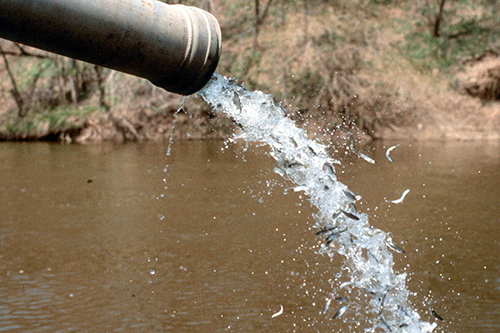

```{r github-auth-2, echo = FALSE, out.width="50%", fig.cap = "Young fish being discharged from pipe"}

```

Source: [Great Lakes Databse](http://www.glfc.org/great-lakes-databases.php)

```{r load-pkg, message = FALSE}
library(tidyverse)
library(skimr)
```

```{r load-data, message = FALSE, warning = FALSE}
# From TidyTuesday: https://github.com/rfordatascience/tidytuesday/blob/master/data/2021/2021-06-08/readme.md
fishing <- readr::read_csv('https://raw.githubusercontent.com/rfordatascience/tidytuesday/master/data/2021/2021-06-08/fishing.csv')
stocked <- readr::read_csv('https://raw.githubusercontent.com/rfordatascience/tidytuesday/master/data/2021/2021-06-08/stocked.csv')
```

## Exercises

### Exercise 1.

Warm up!
Take a look at an overview of the first dataset `fishing` with the `skim()` function.

**Note:** I already gave you the answers to this exercise.
You just need to knit the document and view the output.
A definition of all variables is given in the [Data dictionary] section at the end, though you don't need to familiarize yourself with all variables in order to work through these exercises.

```{r fishing-skim}
skim(fishing)
```

Now let's take a look at an overview of the second dataset `stocked`.

```{r stocked-skim}
skim(stocked)
```

### Exercise 2.

Are people traveling on a whim?
Let's see...

Fill in the blanks for filtering for hotel bookings where the guest is **not** from the US (`country` code `"USA"`) and the `lead_time` is less than 1 day.

**Note:** You will need to set `eval=TRUE` when you have an answer you want to try out.

```{r travel-whim, eval=FALSE}
hotels %>%
  filter(
    country ____ "USA", 
    lead_time ____ ____
    )
```

### Exercise 3.

How many bookings involve at least 1 child **or** baby?

In the following chunk, replace

-   `[AT LEAST]` with the logical operator for "at least" (in two places)
-   `[OR]` with the logical operator for "or"

**Note:** You will need to set `eval=TRUE` when you have an answer you want to try out.

```{r some-children, eval=FALSE}
hotels %>%
  filter(
    children [AT LEAST] 1 [OR] babies [AT LEAST] 1
    )
```

### Exercise 4.

Do you think it's more likely to find bookings with children or babies in city hotels or resort hotels?
Test your intuition.
Using `filter()` determine the number of bookings in resort hotels that have more than 1 child **or** baby in the room?
Then, do the same for city hotels, and compare the numbers of rows in the resulting filtered data frames.

```{r resort-children}
# add code here
# pay attention to correctness and code style
```

```{r city-children}
# add code here
# pay attention to correctness and code style
```

### Exercise 5.

Create a frequency table of the number of `adults` in a booking.
Display the results in descending order so the most common observation is on top.
What is the most common number of adults in bookings in this dataset?
Are there any surprising results?

**Note:** Don't forget to label your R chunk as well (where it says `label-me-1`).
Your label should be short, informative, and shouldn't include spaces.
It also shouldn't repeat a previous label, otherwise R Markdown will give you an error about repeated R chunk labels.

```{r label-me-1}
# add code here
# pay attention to correctness and code style
```

### Exercise 6.

Repeat Exercise 5, once for canceled bookings (`is_canceled` coded as 1) and once for not canceled bookings (`is_canceled` coded as 0).
What does this reveal about the surprising results you spotted in the previous exercise?

**Note:** Don't forget to label your R chunk as well (where it says `label-me-2`).

```{r label-me-2}
# add code here
# pay attention to correctness and code style
```

### Exercise 7.

Calculate minimum, mean, median, and maximum average daily rate (`adr`) grouped by `hotel` type so that you can get these statistics separately for resort and city hotels.
Which type of hotel is higher, on average?

```{r label-me-3}
# add code here
# pay attention to correctness and code style
```

### Exercise 8.

We observe two unusual values in the summary statistics above -- a negative minimum, and a very high maximum).
What types of hotels are these?
Locate these observations in the dataset and find out the arrival date (year and month) as well as how many people (adults, children, and babies) stayed in the room.
You can investigate the data in the viewer to locate these values, but preferably you should identify them in a reproducible way with some code.

**Hint:** For example, you can `filter` for the given `adr` amounts and `select` the relevant columns.

```{r label-me-4}
# add code here
# pay attention to correctness and code style
```

## Data dictionary

Below is the full data dictionary.
Note that it is long (there are lots of variables in the second dataset), but we will be using a limited set of the variables for our analysis.

### fishing.csv

| variable    | class     | description                                                         |
|:------------|:----------|:--------------------------------------------------------------------|
| year        | double    | Year of measurement                                                 |
| lake        | character | Lake Name                                                           |
| species     | character | Species of fish                                                     |
| grand_total | double    | Grand total of observed                                             |
| comments    | character | Comments from the dataset providers                                 |
| region      | character | Region of the US/Canada, note there is some inconsistency           |
| values      | double    | Production amounts have been rounded to the nearest thousand pounds |

### stocked.csv

| variable    | class     | description                                                         |
|:------------|:----------|:--------------------------------------------------------------------|
| year        | double    | Year of measurement                                                 |
| lake        | character | Lake Name                                                           |
| species     | character | Species of fish                                                     |
| grand_total | double    | Grand total of observed                                             |
| comments    | character | Comments from the dataset providers                                 |
| region      | character | Region of the US/Canada, note there is some inconsistency           |
| values      | double    | Production amounts have been rounded to the nearest thousand pounds |
