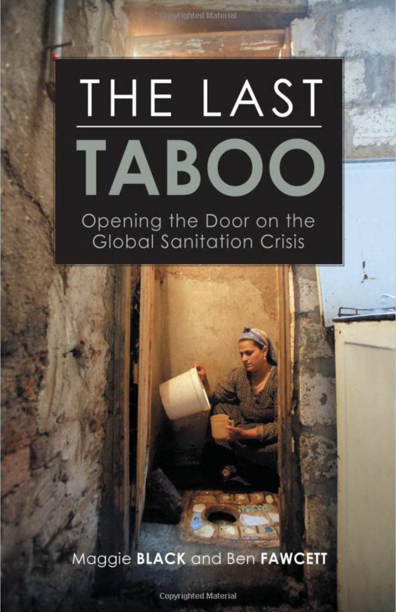

```{r include = FALSE}
knitr::opts_chunk$set(
  eval = FALSE,
  out.width = "80%",
  fig.asp = 0.618,
  fig.width = 6
)
```

```{r photo, fig.margin = TRUE, echo = FALSE, fig.width = 3, fig.cap = "Cover of The Last Tabboo (2008) Black and Fawcett. This book explores the development of sanitation over time and why improvements have lagged behind those in clean water access.", eval = TRUE}

```

The COVID-19 pandemic has exposed our global vulnerability to infectious disease.
Although COVID-19 was unusual in its impact in developed countries, death and sickness from infectious disease is much more common in less developed countries where over 700,000 people globally die each year from preventable infections.

Over the last year, we were all asked to wash our hands frequently to limit the spread of COVID-19, but clean water and sanitation (toilet facilities) are essential for interventions such as hand washing to be effective.
Using a 2020 datset provided by [Our World in Data](https://ourworldindata.org/water-sanitation-2020-update), we will explore trends over time in clean water and sanitation access around the world.

# Getting started

```{marginfigure}
**IMPORTANT:** If there is no GitHub repo created for you for this assignment, it means I didn't have your GitHub username as of when I assigned the homework. Please let me know your GitHub username asap, and I can create your repo.
```

Go to the course GitHub organization and locate your homework repo, which should be named `hw-02-water-sanitation-YOUR_GITHUB_USERNAME`.
Grab the URL of the repo, and clone it in RStudio.
First, open the R Markdown document `hw-02.Rmd` and Knit it.
Make sure it compiles without errors.
The output will be in the file markdown `.md` file with the same name.

## Warm up

Before we introduce the data, let's warm up with some simple exercises.

-   Update the YAML, changing the author name to your name, and **knit** the document.
-   Commit your changes with a meaningful commit message.
-   Push your changes to GitHub.
-   Go to your repo on GitHub and confirm that your changes are visible in your Rmd **and** md files. If anything is missing, commit and push again.

## Packages and Data

We'll use the **tidyverse** package for much of the data wrangling and visualisation.
This package is already installed for you.
The data can be found in the `/data` folder of the starter repo you've just cloned.
You can load the package and data by running the following in your Console:

```{r load-packages-data, message = FALSE}
library(tidyverse)
wat_san <- read_csv("data/water-and-sanitation.csv")
```

## Viewing Data

You can view the dataset as a spreadsheet using the `View()` function.
Note that you should not put this function in your R Markdown document, but instead type it directly in the Console, as it pops open a new window (and the concept of popping open a window in a static document doesn't really make sense...).
When you run this in the console, you'll see the following **data viewer** window pop up.

```{r view-data}
View(wat_san)
```

**NOTE** Normally you can find out more about the dataset by inspecting its documentation, which you can access by running `?wat_san` in the Console or using the Help menu in RStudio to search for `wat_san`.
However, this exercise (and many in this class) use custom dataset for this class, and not integrated into an R package.

More information on this water and sanitation dataset and sanitation access level definitions are available at the [Our World in data](https://ourworldindata.org/sanitation) webpage.

# Exercises

```{marginfigure}
**Hint:** The Markdown Quick Reference sheet has an example of inline R code that might be helpful. You can access it from the Help menu in RStudio.
```

1.  How many observations (rows) does the dataset have? Instead of hard coding the number in your answer, use inline code.
2.  Run `View(wat_san)` in your Console to view the data in the data viewer. What does each row in the dataset represent?

🧶 ✅ ⬆️ *Knit,* *commit, and push your changes to GitHub with an appropriate commit message. Make sure to commit and push all changed files so that your Git pane is cleared up afterwards.*

Each column represents a variable.
We can get a list of the variables in the data frame using the `names()` function.

```{r}
names(wat_san)
```

As the `?wat_san` function will not work (this dataset is not from an R package), we have provided a variable description list here:

-   `Entity`: Individual country name or `world`
-   `Year`: Year of estimate
-   `water_`: Percent of population with a given level of water access
-   `sanitation_`: Percent of population with a given level of water access
-   `_improved`: Improved sanitation access (can be Safely Managed, Basic, or Limited)
-   `_safe`: Best form of improved sanitation (e.g., private toilet)
-   `_basic`: Intermediate form of improved sanitation (e.g., poorly maintained private toilet)
-   `_limited`: Worst form of improved sanitation (e.g., shared toilet)
-   `_unimproved`: Typically a poorly maintained pit latrine
-   `_none`: Open defecation (no sanitation)

3.  Create a faceted histogram where each facet represents a year and displays the distribution of the percent of population with no sanitation access. Does it look like rates of open defecation (no sanitation) have changed between 2000 and 2020? What features of the distributions have changed over time, if any?

```{r}
ggplot(data = ___, mapping = aes(x = ___)) +
  geom_histogram(binwidth = ___) +
  facet_wrap(~___)
```

Let's de-construct this code:

-   `ggplot()` is the function we are using to build our plot, in layers.
-   In the first layer we always define the data frame as the first argument. Then, we define the mappings between the variables in the dataset and the **aes**thetics of the plot (e.g. x and y coordinates, colours, etc.).
-   In the next layer we represent the data with **geom**etric shapes, in this case with a histogram. You should decide what makes a reasonable bin width for the histogram by trying out a few options.
-   In the final layer we facet the data by Entity.

🧶 ✅ ⬆️ Knit, *commit, and push your changes to GitHub with an appropriate commit message. Make sure to commit and push all changed files so that your Git pane is cleared up afterwards.*

4.  Use a single pipeline to identity the countries with the highest rates of open defecation in the year 2000, and arrange these in descending order.
    Compare the `water_none` and `sanitation_none` columns in the output.
    Does it appear that water and sanitation infrastructure are well-correlated, or not?

5.  Then, in another pipeline, filter the entire dataset (all countries) for the year 2000 and use a scatter plot to visualize the relationship between `water_none` and `sanitation_none`.
    Does this relationship support your previous response about a correlation between the variables, and why?

6.  In a third pipeline, identity the countries with the highest rates of open defecation in the year 2020, and arrange these in descending order.
    Have the countries changed between 2000 and 2020?
    If so, which have been added and which have been lost?

7.  In a final pipeline, calculate the minimum, mean, median, standard deviation, IQR, and maximum rates of `water_none` and `sanitation_none` in the year 2000 and the year 2020 for the 5 countries with the highest amount of open defecation.
    You'll need to use `group_by` and remember to filter out the `Entity` "World".
    What do you notice about the values between 2000 and 2020?
    What do you notice about the values for sanitation vs. water?

8.  Create a final visualization that selects a few entities and that will help you understand why the five countries with the highest rates of open defecation changed between 2000 and 2020.
    Include the entity "World" so that you can compare rates of change between individual countries and the world as a whole.
    Explore the use of different `geom_` to best visualize these trends.
    Comment on the rates of change in open defecation over time in some of the countries.

🧶 ✅ ⬆️ Knit, *commit, and push your changes to GitHub with an appropriate commit message. Make sure to commit and push all changed files so that your Git pane is cleared up afterwards and review the md document on GitHub to make sure you're happy with the final state of your work.*
