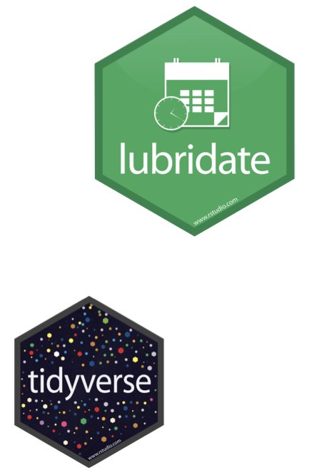

```{r setup, include = FALSE}
knitr::opts_chunk$set(eval = TRUE)
```

# Learning goals

-   Learn how to identify and distinguish different R object classes
-   Practice creating and manipulating different R object classes
-   Practice manipulating factor data with forcats and dates with lubridate

# Getting started

If you're looking at these instructions you've already done the following steps, but as a reminder:

-   Go to the course GitHub organization and locate your Unit 3 repo, which should be named `unit-4-YOUR_LAST_NAME`.
-   Grab the URL of the repo, and clone it in RStudio.
-   First, open the R Markdown instructions `hw-O4-classes-forcats` and the lab starter `hw-04.Rmd` and Knit them
-   Make sure they compile without errors.

## Data

We will mostly use objects that we create ourselves, as well as some use of the `earthquakes` dataset from the `{openintro}` package we have used before.
We will also need `{tidyverse}` for some `{forcats}` and `{lubridate}`.
We will need to load the latter separately because, unlike `forcats` it is not automatically loaded with the tidyverse.

## Packages

```{r message = FALSE}
library(openintro)
library(tidyverse)
library(lubridate)
```

## Warm up

Before we introduce the data, let's warm up with some simple exercises.

-   Update the YAML, changing the author name to your name, and **knit** the document.
-   Commit your changes with a meaningful commit message.
-   Push your changes to GitHub.
-   Go to your repo on GitHub and confirm that your changes are visible in your Rmd **and** md files. If anything is missing, commit and push again.

## Data classes exercises (vector, data frames, lists)

1.  Insert a code chunk in your starter file under Exercise 1. Use the concatenate function `c()` to create three separate vectors, each containing five elements (i.e. length = 5). The vectors can include anything you want but make sure one is all numeric, one is all character, and one is a mix of character and numeric. Assign each vector to the following vector object names: `numeric`, `character`, `mixed`. Remember to label your code chunk. **Lastly**, using in-line code beneath your code chunk, report the `typeof()` and `class()` of each vector.

🧶 ✅ ⬆️ Knit, *commit, and push your changes to GitHub with an appropriate commit message.*

2.  Copy the code chunk below into your starter file under Exercise 2 and complete it. The first line uses a new function `bind_cols()` to bind each vector together as columns in a data frame and assigns the data frame to the object `data_frame`. *Note that within `bind_cols()` the vectors are assigned to new variable names.* Add a second line that will ensure our renamed data frame is output in the .html file. Don't forget to label the code chunk and change `eval` = T. **Lastly**, using in-line code beneath your code chunk, report the`typeof()` and `class()` of the data frame.

```{r label-me1, eval = F}
___ <- bind_cols("numeric" = numeric, "___" = character, "___" = ___)
___
```

🧶 ✅ ⬆️ Knit, *commit, and push your changes to GitHub with an appropriate commit message.*

3.  Insert a code chunk in your starter file under Exercise 3. Use the concatenate function to create three separate vectors of the same type as before. This time, two vectors should contain 5 elements, but **one vector should only contain 4 elements.** Again, assign each vector to object names: `numeric`, `character`, `mixed`. In a final lines of code, try to use `bind_cols()` again to bind the three new vectors. Why does this not work? Answer the last question in text narrative beneath your chunk. To allow your document to knit, either comment out the problematic line using `#` or set eval = F in the code chunk header.

🧶 ✅ ⬆️ Knit, *commit, and push your changes to GitHub with an appropriate commit message.*

4.  Copy the code chunk below into Exercise 4 in your starter file, and complete it to create a list from the same three vectors created in Exercise 3. Write in narrative beneath the chunk why this function works.

```{r label-me2, eval = F}
___ <- list("___" = numeric, "___" = character, "mixed" = ___)
my_list
```

🧶 ✅ ⬆️ Knit, *commit, and push your changes to GitHub with an appropriate commit message.*

## `forcats` exercises (factors)

```{r forcats, fig.margin = TRUE, echo = FALSE, fig.width = 3, fig.cap = "forcats is automatically loaded as part of the tidyverse", eval = TRUE}
knitr::include_graphics("img/forcats-part-of-tidyverse.png")
```

5.  

🧶 ✅ ⬆️ Knit, *commit, and push your changes to GitHub with an appropriate commit message.*

6.  

🧶 ✅ ⬆️ Knit, *commit, and push your changes to GitHub with an appropriate commit message.*

## `lubridate` exercises (dates)

```{r lubridate, fig.margin = TRUE, echo = FALSE, fig.width = 3, fig.cap = "lubridate needs to be loaded separately, but is also part of the tidyverse", eval = TRUE}

```

7.  

🧶 ✅ ⬆️ Knit, *commit, and push your changes to GitHub with an appropriate commit message.*

8.  

🧶 ✅ ⬆️ Knit, *commit, and push your changes to GitHub with an appropriate commit message.*

9.  

🧶 ✅ ⬆️ Knit, *commit, and push your changes to GitHub with an appropriate commit message.*

Great work!
You are finished with Homework 4!
🧶 ✅ ⬆️ Knit, *commit, and push your changes to GitHub with an appropriate commit message.*
