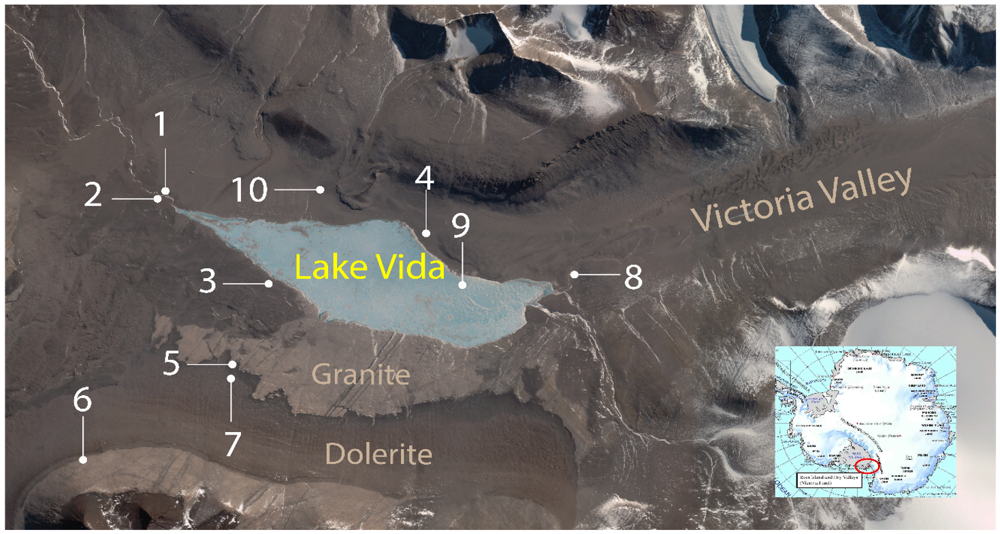

```{r packages, echo=FALSE, message=FALSE, warning=FALSE}
library(tidyverse)
library(emo)
```

class: middle

# Survey Results

---

## Goals of Group Exercises

.pull-left-wide[
**Practice Data Visualization and Data Wrangling**  


**Get used to collaborative work**    

*On Rstudio Projects sharing the same GitHub Repository. 

]

---

## Exercise Format

- Form groups (max 5 per group)

---

## Exercise Format

- Form groups (max 5 per group)
- All members clone `unit2-review-exercises-GROUP#` into RStudioCloud

---

## Exercise Format

- Form groups (max 5 per group)
- All members clone `unit2-review-exercises-GROUP#` into RStudioCloud
- We will provide a numbered list prompt. For example: 
    1. Select the first 3 variables in the `penguins` data frame
    2. Filter for the `Gentoo` penguin species
    3. Pass the output to ggplot() 
    4. Create a scatter plot between `bill_length_mm` and `flipper_length_mm`
    5. Visualize the different `species` with different shapes   
    
---

## Exercise Format

- Form groups (max 5 per group)
- All members clone `unit2-review-exercises-GROUP#` into RStudioCloud
- We will provide a numbered list prompt.
    
- Pick someone to go first (next birthday?)
    1. **If it's your turn:** Write code for the first item. Knit, commit *with a message*, and push! 
    -   **(Suggestion: "completed exercise 1.1" for Exercise 1 bullet 1)**
    2. **Everyone else:** pull the changes from GitHub. 
    3. **Next person clockwise:** Write code for the next item. Knit, commit and push!
    4. Keep going until you complete the exercise. Check it runs!
    5. For the next exercise, rotate to a new "first person".
    
- NOTES: Help the person who is making, committing, and pushing changes.
- At least one person must be connected to the Zoom (to share screen later)
- If you are joining remotely, work on an `unit2-review-exercises-GROUP#` independently

---

## Data: Lake Vida (Antarctica) Sand Dataset

```{r echo=FALSE, out.width="40%", fig.align="left"}

```

Help page: Joey! 

Four data frames (which we will wrangle, join, pivot, and visualize!):

1. `sand_minerals`: mineral types found in sand grains across 10 sites
2. `density`: the density of each mineral
3. `solubility_hardness`: the solubility and hardness of each mineral
4. `site_descriptions`: text descriptions of each site's location

---

## Warm-up

1. **Everyone:** Open up starter file
1. **First person:** Update YAML with group # (and name if you want) and date
2. **Everyone else:** Pull the changes and take a look

**Remember:**
- 1 person: Edit, knit, commit, push
- Everyone: Pull changes and inspect
- Next person (clockwise): Edit, knit commit push...

---

## Exercise 1: Inspect the first data frame

Under Exercise 1 in your starter file:

1. Delete existing text, insert and label a code chunk named `inspect-sand-minerals`
  - (Edit, knit, commit, push)
2. Add a line of code that outputs a "glimpse" of the `sand-minerals` data ;)
3. Add text narrative below the chunk stating the number of rows and variables
4. Add text stating what each row is (exactly!)
5. Add a second line of code within the original code chunk that outputs the variable names

Remember: 
- 1 person: Edit, knit, commit, push
- Everyone: Pull changes and inspect
- Next person: Edit, knit commit push...

---

class: middle

# Exercise 1 Solution

---

## Exercise 2: Inspect the other three data frames

Under Exercise 2 in your starter file:

1. Delete existing text, insert and label a code chunk named `inspect-other-dataframes`
2. Add three line of code that outputs a "glimpse" of the other three data frames ;)
    - `density`, `solubility_hardness` and `site_descriptions`
3. Add text narrative below the chunk stating the number of rows and variables for each data frame
4. Add text stating what each row is (exactly!) in each data frame
5. Add a fourth, fifth, and sixth line of code within the original code chunk that outputs the variable names

Remember: 
- 1 person: Edit, knit, commit, push
- Everyone: Pull changes and inspect
- Next person: Edit, knit commit push...

---

## Exercise 3: Join `density` to `sand_minerals`, then join `solubility_hardness`

Under Exercise 3 in your starter file:

1. Delete existing text, insert and label a code chunk named `join-minerals-density`
2. Write a pipeline to to join `density` to `sand_mineral`, retaining all rows in `sand_minerals`
3. Assign the output to a new data frame object named `sand_mineral_density`
4. Write a pipeline to to join `solubility_hardness` to `sand_mineral_density`, retaining all rows in `sand_minerals`
5. Assign the output to a new data frame object named `sand_mineral_properties`

Remember: 
- 1 person: Edit, knit, commit, push
- Everyone: Pull changes and inspect
- Next person: Edit, knit commit push...

---

.center[
.large[
This class content was built from the Data Science in a Box source materials.
https://datasciencebox.org/index.html
]
]
