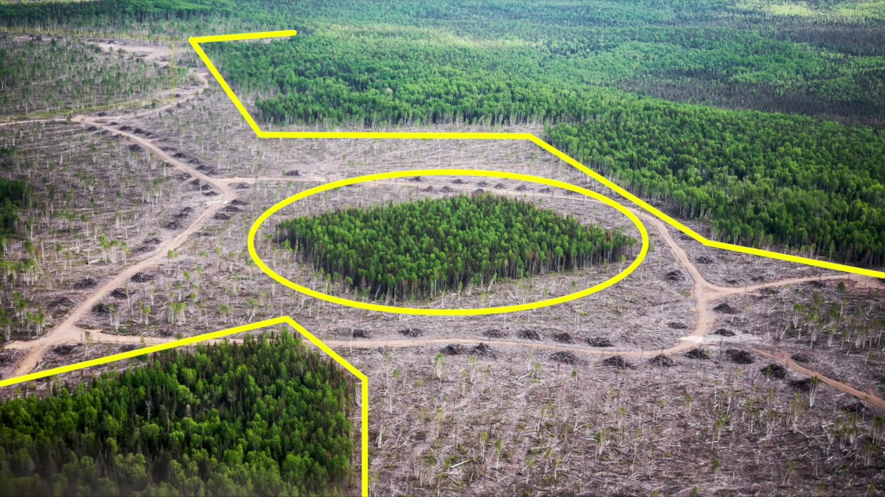

```{r packages, echo=FALSE, message=FALSE, warning=FALSE}
library(tidyverse)
library(openintro)
forest_birds <- read.csv("data/forest.birds.csv")
```

class: middle

# Terminology

---

## Number of variables involved

- Univariate data analysis - distribution of single variable
- Bivariate data analysis - relationship between two variables
- Multivariate data analysis - relationship between many variables at once, usually focusing on the relationship between two while conditioning for others

---

## Types of variables

- **Numerical variables** can be classified as **continuous** or **discrete** based on whether or not the variable can take on an infinite number of values or only non-negative whole numbers, respectively.
- If the variable is **categorical**, we can determine if it is **ordinal** based on whether or not the levels have a natural ordering.

---

class: middle

# Data

---

## Data: Forest Birds 

.pull-left-wide[

- Abundance of forest birds in 56 forest patches in Australia.

- Part of a study on the effects of **habitat fragmentation**, the process in which land development disrupts the native habitat of certain species. 

- The dataset has variables on forest bird abundance in a forest patch (typically the response of interest) and features of patch.
]
.pull-right-narrow[
```{r echo=FALSE, out.width = "100%"}

```
]

---

## Take a peek at data

```{r output.lines=18}
library(tidyverse)
forest_birds <- read.csv("data/forest.birds.csv")
glimpse(forest_birds)
```

---

## Selected variables

<br>

.midi[
variable        | description
----------------|-------------
`abundance` |	Average number of forest birds observed in the patch, as calculated from several 20-min counts.
`patch.area` |The area of the patch. Areas were measured in hectares; 1 hectare is 10,000 square meters.
`year.of.isolation`	| The year the patch was isolated by fragmentation of local environment.
`dist.nearest` | Distance to the nearest patch, measured in kilometers.
`dist.larger` | Distance to the nearest patch that is larger than the current patch, measured in kilometers.
`grazing.intensity` |	A score indicating the extent of livestock grazing. The categories are: "light", "less than average", "average", "moderately heavy", "heavy".
`altitude` | Altitude of the patch, measured in meters.
`yrs.isolation` | Number of years of isolation at the time study was conducted (1983).
]

---

## Variable types

<br>

variable        | type
----------------|-------------
`abundance`  |	numerical, continuous
`patch.area` |	___, ___
`year.of.isolation`	| numerical, ___
`dist.nearest` | ___, ___
`dist.larger` |	___, ___
`grazing.intensity` |	___, ___
`altitude`  | ___, ___
`yrs.isolation` | ___, ___

---

class: middle

# Visualizing numerical data

---

## Describing shapes of numerical distributions

- shape:
    - skewness: right-skewed, left-skewed, symmetric (skew is to the side of the longer tail)
    - modality: unimodal, bimodal, multimodal, uniform
- center: mean (`mean`), median (`median`), mode (not always useful)
- spread: range (`range`), standard deviation (`sd`), inter-quartile range (`IQR`)
- unusual observations (outliers)

---

class: middle

# Histograms

---

## Histogram

```{r message = TRUE, out.width = "30%"}
ggplot(forest_birds, aes(x = abundance)) +
  geom_histogram()
```

---

## Histograms and binwidth

.panelset[
.panel[.panel-name[binwidth = 20].pull-left[
```{r out.width = "50%"}
ggplot(forest_birds, aes(x = abundance)) +
  geom_histogram(binwidth = 20)
```
]
]
.panel[.panel-name[binwidth = 2].pull-right[
```{r out.width = "50%"}
ggplot(forest_birds, aes(x = abundance)) +
  geom_histogram(binwidth = 2)
```
]
]
]

---

## Customizing histograms

.panelset[
.panel[.panel-name[Plot].pull-left[
```{r ref.label = "hist-custom", echo = FALSE, warning = FALSE, fig.width = 6, fig.height= 6}
```
]
]
.panel[.panel-name[Code]
```{r hist-custom, fig.show = "hide", warning = FALSE}
ggplot(forest_birds, aes(x = abundance)) +
  geom_histogram(binwidth = 2) +
  labs( #<<
    x = "Abundance", #<<
    y = "Frequency", #<<
    title = "Abundance of Forest Birds in 56 Forest Patches" #<<
  ) #<<
```
]
]

---

## Fill with a categorical variable

.panelset[
.panel[.panel-name[Plot].pull-left[
```{r ref.label = "hist-fill", echo = FALSE, warning = FALSE, fig.width = 5, fig.height= 5}
```
]
]
.panel[.panel-name[Code]
```{r hist-fill, fig.show = "hide", warning = FALSE}
ggplot(forest_birds, aes(x = abundance,
                         fill = grazing.intensity)) +
  geom_histogram(binwidth = 2,
                 alpha = 0.5) +
  labs( #<<
    x = "Abundance", #<<
    y = "Frequency", #<<
    title = "Abundance of Forest Birds in 56 Forest Patches" #<<
  ) #<<
```
]
]

---

## Facet with a categorical variable

.panelset[
.panel[.panel-name[Plot].pull-left[
```{r ref.label = "hist-facet", echo = FALSE, warning = FALSE, fig.width = 4, fig.height= 6}
```
]
]
.panel[.panel-name[Code]
```{r hist-facet, fig.show = "hide", warning = FALSE}
ggplot(forest_birds, aes(x = abundance)) +
  geom_histogram(binwidth = 2) +
  labs( #<<
    x = "Abundance", #<<
    y = "Frequency", #<<
    title = "Abundance of Forest Birds in 56 Forest Patches") +
  facet_wrap(~ grazing.intensity, nrow = 3) #<<
```
]
]

---

class: middle

# Density plots

---

## Density plot

```{r fig.width = 4, fig.height= 3}
ggplot(forest_birds, aes(x = abundance)) +
  geom_density()
```

---

## Density plots and adjusting bandwidth

.panelset[
.panel[.panel-name[adjust = 0.5].pull-left[
```{r out.width = "50%"}
ggplot(forest_birds, aes(x = abundance)) +
  geom_density(adjust = 0.5)
```
]
]
.panel[.panel-name[adjust = 1].pull-right[
```{r out.width = "50%"}
ggplot(forest_birds, aes(x = abundance)) +
  geom_density(adjust = 1) # default bandwidth
```
]
]
]

---

## Customizing density plots

.panelset[
.panel[.panel-name[Plot].pull-left[
```{r ref.label = "density-custom", echo = FALSE, warning = FALSE, fig.width = 5, fig.height= 5}
```
]
]
.panel[.panel-name[Code]
```{r density-custom, fig.show = "hide", warning = FALSE}
ggplot(forest_birds, aes(x = abundance)) +
  geom_density(adjust = 0.5) +
  labs( #<<
    x = "Abundance", #<<
    y = "Density", #<<
    title = "Abundance of Forest Birds in 56 Forest Patches" #<<
  ) #<<
```
]
]

---

## Adding a categorical variable

.panelset[
.panel[.panel-name[Plot].pull-left[
```{r ref.label = "density-cat", echo = FALSE, warning = FALSE, fig.width = 6, fig.height= 6}
```
]
]
.panel[.panel-name[Code]
```{r density-cat, fig.show = "hide", warning = FALSE}
ggplot(forest_birds, aes(x = abundance, 
                  fill = grazing.intensity)) + #<<
  geom_density(adjust = 0.5, 
               alpha = 0.3) + #<<
  labs(
    x = "Abundance",
    y = "Density",
    title = "Abundance of Forest Birds in 56 Forest Patches", 
    fill = "Grazing Intensity" #<<
  )
```
]
]

---

class: middle

# Box plots

---

## Box plot

```{r out.width = "30%"}
ggplot(forest_birds, aes(x = abundance)) +
  geom_boxplot()
```

---

## Box plot and outliers

```{r out.width = "30%"}
ggplot(forest_birds, aes(x = dist.nearest)) +
  geom_boxplot()
```

---

## Customizing box plots

.panelset[
.panel[.panel-name[Plot].pull-left[
```{r ref.label = "box-custom", echo = FALSE, warning = FALSE, fig.width = 6, fig.height= 6}
```
]
]
.panel[.panel-name[Code]
```{r box-custom, fig.show = "hide", warning = FALSE}
ggplot(forest_birds, aes(x = abundance)) +
  geom_boxplot() +
  labs(
    x = "Abundance",
    y = NULL,
    title = "Abundance of Forest Birds in 56 Forest Patches"
  ) +
  theme( #<<
    axis.ticks.y = element_blank(), #<<
    axis.text.y = element_blank() #<<
  ) #<<
```
]
]

**Whiskers = 1st or 3rd Quartile (side of box) +/- 1.5 * Interquartile Range (width of box)**


---

## Adding a categorical variable

.panelset[
.panel[.panel-name[Plot].pull-left[
```{r ref.label = "box-cat", echo = FALSE, warning = FALSE, fig.width = 6, fig.height= 6}
```
]
]
.panel[.panel-name[Code]
```{r box-cat, fig.show = "hide", warning = FALSE}
ggplot(forest_birds, aes(x = abundance,
                  y = grazing.intensity)) + #<<
  geom_boxplot() +
  labs(
    x = "Abundance",
    y = "Grazing Intensity",
    title = "Abundance of Forest Birds in 56 Forest Patches",
    subtitle = "by grazing intensity" #<<
  )
```
]
]

---

class: middle

# Relationships numerical variables

---

## Scatterplot

```{r warning = FALSE, fig.width = 8, fig.height= 6}
ggplot(forest_birds, aes(x = patch.area, y = altitude)) +
  geom_point()
```

---

## Hex plot

```{r warning = FALSE, fig.width = 8, fig.height= 6}
ggplot(forest_birds, aes(x = patch.area, y = altitude)) +
  geom_hex()
```

---

## Hex plot

```{r warning = FALSE, fig.width = 8, fig.height= 6}
ggplot(forest_birds %>% filter(patch.area < 100), 
       aes(x = patch.area, y = altitude)) +
  geom_hex()
```

---

## Summary

**ggplot2 geoms for numerical data**

  - **histograms** (frequency plots) - good for an overview: `geom_histogram()`
  
  - **density plots** - a smooth overview: `geom_density()`
  
  - **box plots** - incorporates summary stats (e.g., median): `geom_boxplot()`
  
  - **scatter plots** - good for exploring associations: `geom_point()`
  
  - **hex plots** - explore associations in dense scatter plot: `geom_hex()`

---

.center[
.large[
This class content was built from the Data Science in a Box source materials.
https://datasciencebox.org/index.html
]
]