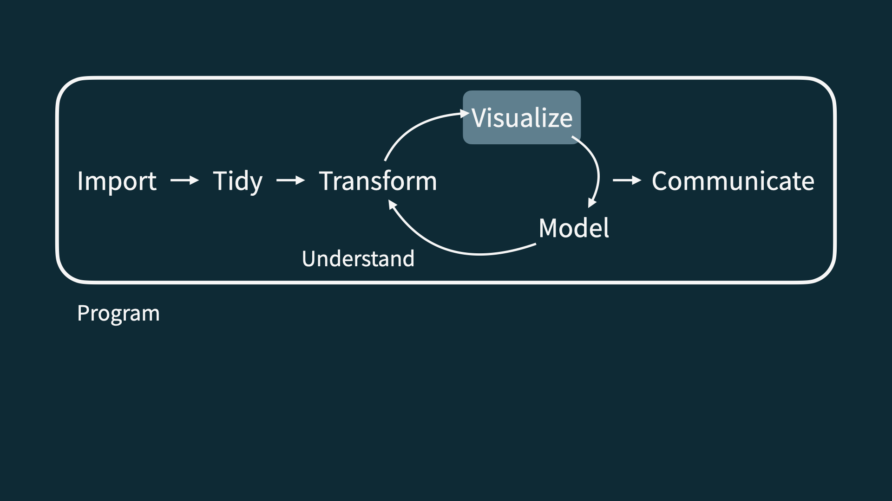
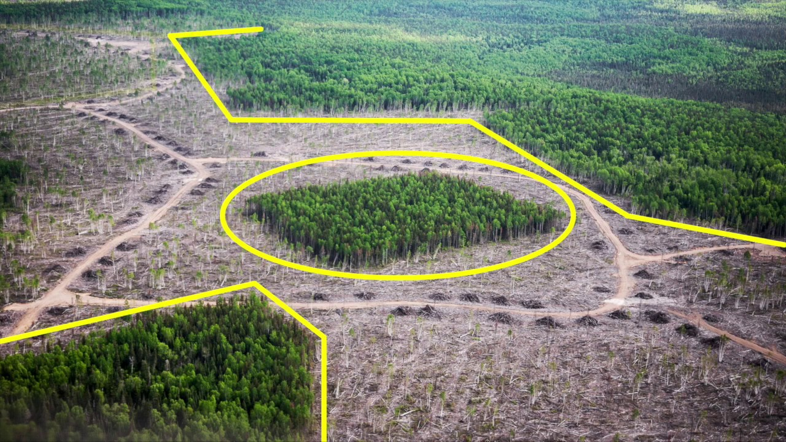

```{r packages, echo=FALSE, message=FALSE, warning=FALSE}
library(tidyverse)
library(openintro)
forest_birds <- read.csv("data/forest.birds.csv")
```

class: middle

# Recap

---

```{r echo=FALSE, out.width="90%", fig.align="left"}

```

---

## Numerical Geoms Summary

**ggplot2 geoms for numerical data**

  - **histograms** (frequency plots) - good for an overview: `geom_histogram()`
  
  - **density plots** - a smooth overview: `geom_density()`
  
  - **box plots** - incorporates summary stats (e.g., median): `geom_boxplot()`
  
  - **scatter plots** - good for exploring associations: `geom_point()`
  
  - **hex plots** - explore associations in dense scatter plot: `geom_hex()`

---

## Data: Forest Birds 

.pull-left-wide[

- Abundance of forest birds in 56 forest patches in Australia.

- Part of a study on the effects of **habitat fragmentation**, the process in which land development disrupts the native habitat of certain species. 

- The dataset has variables on forest bird abundance in a forest patch (typically the response of interest) and features of patch.
]
.pull-right-narrow[
```{r echo=FALSE, out.width = "80%"}

```
]

---

### Data 

```{r}
library(openintro)
forest_birds <- read.csv("data/forest.birds.csv")
glimpse(forest_birds)
```

---

### Create a new variable: `abundance_rating`

```{r}
forest_birds <- forest_birds %>% 
  mutate(abundance_rating = ifelse(abundance > 30, "3 high", NA),
         abundance_rating = ifelse(abundance <= 30 & abundance >= 10, "2 medium", abundance_rating),
         abundance_rating = ifelse(abundance < 10, "1 low", abundance_rating)) 
```

---

### Data 

```{r}
glimpse(forest_birds)
```

---

class: middle

# Bar plot

---

## Bar plot

```{r out.width="40%"}
ggplot(forest_birds, aes(x = abundance_rating)) +
  geom_bar()
```

---

## Segmented bar plot

```{r out.width="40%"}
ggplot(forest_birds, aes(x = abundance_rating, 
                  fill = grazing.intensity)) + #<<
  geom_bar()
```

---

## Segmented bar plot

```{r out.width="40%"}
ggplot(forest_birds, aes(x = abundance_rating, fill = grazing.intensity)) +
  geom_bar(position = "fill") #<<
```

---

.question[
Which bar plot is a more useful representation for visualizing the relationship between abundance and grazing intensity?
]

  .pull-left[
```{r echo=FALSE, out.width = "100%"}
ggplot(forest_birds, aes(x = abundance_rating, fill = grazing.intensity)) +
  geom_bar()
```
]
.pull-right[
```{r echo=FALSE, out.width = "100%"}
ggplot(forest_birds, aes(x = abundance_rating, fill = grazing.intensity)) +
  geom_bar(position = "fill")
```
]

---

## Customizing bar plots

.panelset[
.panel[.panel-name[Plot].pull-left[
```{r ref.label = "bar-custom", echo = FALSE, warning = FALSE, out.width="90%"}
```
]
]
.panel[.panel-name[Code].pull-right[
```{r bar-custom, fig.show = "hide", warning = FALSE, out.width="90%"}
ggplot(forest_birds, aes(y = abundance_rating, #<<
                  fill = grazing.intensity)) +
  geom_bar(position = "fill") +
  labs( x = "Proportion", #<<
    y = "Abundance Rating", #<<
    fill = "Grazing Intensity", #<<
    title = "Grazing intensity near forest patches", #<<
    subtitle = "and bird abundance rating of patch" #<<
  ) 
```
]
]
]

---

class: middle

# Relationships between numerical and categorical variables

---

## Already talked about...

- Colouring and faceting histograms and density plots
- Side-by-side box plots

---

## Violin plots

```{r warning = FALSE, out.width="40%"}
ggplot(forest_birds, aes(x = grazing.intensity, y = abundance)) +
  geom_violin()
```

---

## Ridge plots

.panelset[
.panel[.panel-name[Plot].pull-left[
```{r ref.label = "ridge-plot", echo = FALSE, warning = FALSE, message = F, out.width="90%"}
```
]
]
.panel[.panel-name[Code].pull-right[
```{r ridge-plot, fig.show = "hide", warning = FALSE, message = F, out.width="90%"}
library(ggridges)
ggplot(forest_birds, aes(x = abundance, y = grazing.intensity, fill = grazing.intensity, color = grazing.intensity)) + 
  geom_density_ridges(alpha = 0.5)
```
]
]
]


---

## Categorical (or Mixed) Geoms Summary


  **ggplot2 geoms for categorical or mixed data**
  
  - **bar plots** - frequency plots by category: `geom_bar()` (segmented, axis flip)
  
  - **violin plots** - distribution by category (similar to box plots): `geom_violin()` 
   
  - **ridge plots** - distribution by category (similar to box plots): `geom_density_ridges()` `{ggridges}`


---

.center[
.large[
This class content was built from the Data Science in a Box source materials.
https://datasciencebox.org/index.html
]
]
