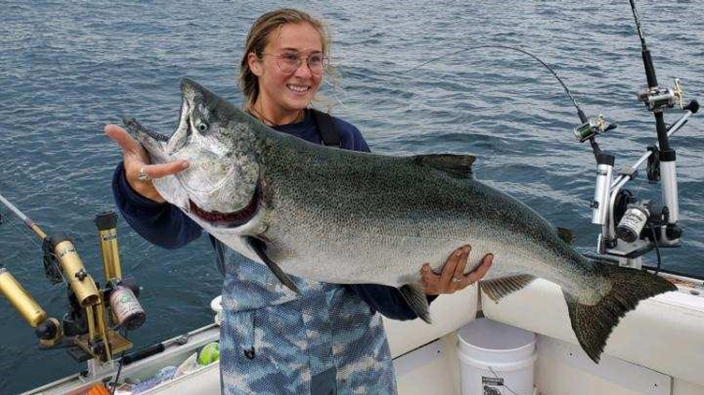
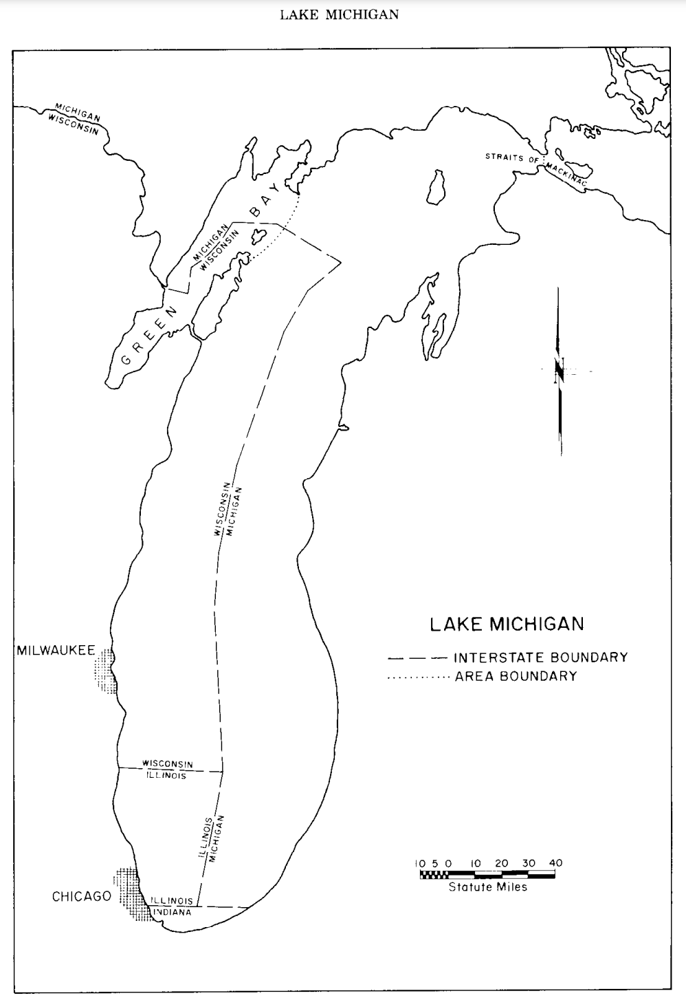

```{r packages, echo=FALSE, message=FALSE, warning=FALSE}
library(tidyverse)
```

class: middle

# Grammar of data wrangling

---

## A grammar of data wrangling...

... based on the concepts of functions as verbs that manipulate data frames

.pull-left[
```{r dplyr-part-of-tidyverse, echo=FALSE, out.width="70%", caption = "dplyr is part of the tidyverse"}
knitr::include_graphics("img/dplyr-part-of-tidyverse.png")
```
]
.pull-right[
.midi[
- `select`: pick columns by name
- `arrange`: reorder rows
- `slice`: pick rows using index(es)
- `filter`: pick rows matching criteria
- `distinct`: filter for unique rows
- `mutate`: add new variables
- `summarise`: reduce variables to values
- `group_by`: for grouped operations
- ... (many more)
]
]

---

## Rules of **dplyr** functions

- First argument is *always* a data frame
- Subsequent arguments say what to do with that data frame
- Always return a data frame
- Don't modify in place

---

## Data: Commercial Fish Production In The Great Lakes 1867-2015

- Data on annual fish catch (weight in lbs) from the Great Lakes (Superior, Michigan, Huron, Erie, and Ontario)
- Observations: Each row represents the annual catch for a particular species

```{r load-data, message = FALSE, warning = FALSE}
catch_data <- readr::read_csv('https://raw.githubusercontent.com/rfordatascience/tidytuesday/master/data/2021/2021-06-08/fishing.csv')
```

.pull-right[
```{r fishing, echo=FALSE, out.width="100%", caption = "Fish catch"}

```
]
.footnote[
Source: [Great Lakes Database](http://www.glfc.org/great-lakes-databases.php)
]

---

## First look: Variables
```{r output.lines=9}
names(catch_data)
```

```{r lakes, echo=FALSE, out.width="30%", caption = "Lake Michgan regions"}

```

---

## Second look: Overview

```{r output.lines=18}
glimpse(catch_data)
```

---

## Select a single column

View only `lead_time` (number of days between booking and arrival date):

```{r}
select(catch_data, values)
```

---

## Select a single column

.pull-left[
```{r eval=FALSE}
select( #<<
  catch_data, 
  values
  )
```
]
.pull-right[
- Start with the function (a verb): `select()`
]

---

## Select a single column

.pull-left[
```{r eval=FALSE}
select( 
  catch_data, #<<
  values
  )
```
]
.pull-right[
- Start with the function (a verb): `select()`
- First argument: data frame we're working with , `catch_data`
]

---

## Select a single column

.pull-left[
```{r eval=FALSE}
select( 
  catch_data, 
  values #<<
  )
```
]
.pull-right[
- Start with the function (a verb): `select()`
- First argument: data frame we're working with , `catch_data`
- Second argument: variable we want to select, `values`
]

---

## Select a single column

.pull-left[
```{r}
select( 
  catch_data, 
  values
  )
```
]
.pull-right[
- Start with the function (a verb): `select()`
- First argument: data frame we're working with , `catch_data`
- Second argument: variable we want to select, `values`
- Result: data frame with `r nrow(catch_data)` rows and 1 column
]

---

.tip[
dplyr functions always expect a data frame and always yield a data frame.
]

```{r}
select(catch_data, values)
```

---

## Select multiple columns


View only the `year` type and `values`:

--

.pull-left[
```{r}
select(catch_data, year, values)
```
]
--
.pull-right[
.question[
What if we wanted to select these columns, and then arrange the data in descending order of lead time?
]
]

---

## Data wrangling, step-by-step

.pull-left[
Select:
```{r}
catch_data %>%
  select(year, values)
```
]

--
.pull-right[
Select, then arrange:
```{r}
catch_data %>%
  select(year, values) %>%
  arrange(desc(values))
```
]

---

class: middle

# Pipes

---

## What is a pipe?

In programming, a pipe is a technique for passing information from one process to another.

--

.pull-left[
- Start with the data frame `catch_data`, and pass it to the `select()` function,
]
.pull-right[
.small[
```{r}
catch_data %>% #<<
  select(year, values) %>%
  arrange(desc(values))
```
]
]

---

## What is a pipe?

In programming, a pipe is a technique for passing information from one process to another.

.pull-left[
- Start with the data frame `catch_data`, and pass it to the `select()` function,
- then we select the variables `year` and `values`,
]
.pull-right[
.small[
```{r}
catch_data %>%
  select(year, values) %>% #<<
  arrange(desc(values))
```
]
]

---

## What is a pipe?

In programming, a pipe is a technique for passing information from one process to another.

.pull-left[
- Start with the data frame `catch_data`, and pass it to the `select()` function,
- then we select the variables `year` and `values`,
- and then we arrange the data frame by `values` in descending order.
]
.pull-right[
.small[
```{r}
catch_data %>%
  select(year, values) %>% 
  arrange(desc(values)) #<<
```
]
]

---

## Aside

The pipe operator is implemented in the package **magrittr**, though we don't need to load this package explicitly since **tidyverse** does this for us.

--

.question[
Any guesses as to why the package is called magrittr?
]

--

.pull-left[
```{r magritte, echo=FALSE, out.width="90%", caption = "Magritte's pipe"}
knitr::include_graphics("img/magritte.jpg")
```
]
.pull-right[
```{r magrittr, echo=FALSE, out.width="100%", caption = "magrittr's pipe"}
knitr::include_graphics("img/magrittr.jpg")
```
]

---

## How does a pipe work?

- You can think about the following sequence of actions - find keys, 
unlock car, start car, drive to work, park.

--
- Expressed as a set of nested functions in R pseudocode this would look like:
```{r eval=FALSE}
park(drive(start_car(find("keys")), to = "work"))
```

--
- Writing it out using pipes give it a more natural (and easier to read) 
structure:
```{r eval=FALSE}
find("keys") %>%
  start_car() %>%
  drive(to = "work") %>%
  park()
```

---

## A note on piping and layering

- `%>%` used mainly in **dplyr** pipelines, *we pipe the output of the previous line of code as the first input of the next line of code*

--
- `+` used in **ggplot2** plots is used for "layering", *we create the plot in layers, separated by `+`*

---

## dplyr

.midi[
`r emo::ji("x")`

```{r error=TRUE}
catch_data +
  select(year, values)
```

`r emo::ji("white_check_mark")`

```{r eval=FALSE}
catch_data %>%
  select(year, values)
```

```{r echo=FALSE, output.lines=6}
catch_data %>%
  select(year, values)
```
]

---

## ggplot2

.midi[
`r emo::ji("x")`

```{r error=TRUE}
ggplot(catch_data, aes(x = values, fill = region)) %>%
  geom_bar()
```

`r emo::ji("white_check_mark")`

```{r out.width="25%"}
ggplot(catch_data, aes(x = values, fill = region)) +
  geom_bar()
```
]

---

## Code styling

Many of the styling principles are consistent across `%>%` and `+`:

- always a space before
- always a line break after (for pipelines with more than 2 lines)

`r emo::ji("x")`

```{r eval=FALSE}
ggplot(catch_data,aes(x=region,y=values))+geom_bar()
```

`r emo::ji("white_check_mark")`

```{r eval=FALSE}
ggplot(catch_data, aes(x = region, y = values)) + 
  geom_bar()
```

---

.center[
.large[
This class content was built from the Data Science in a Box source materials.
https://datasciencebox.org/index.html
]
]