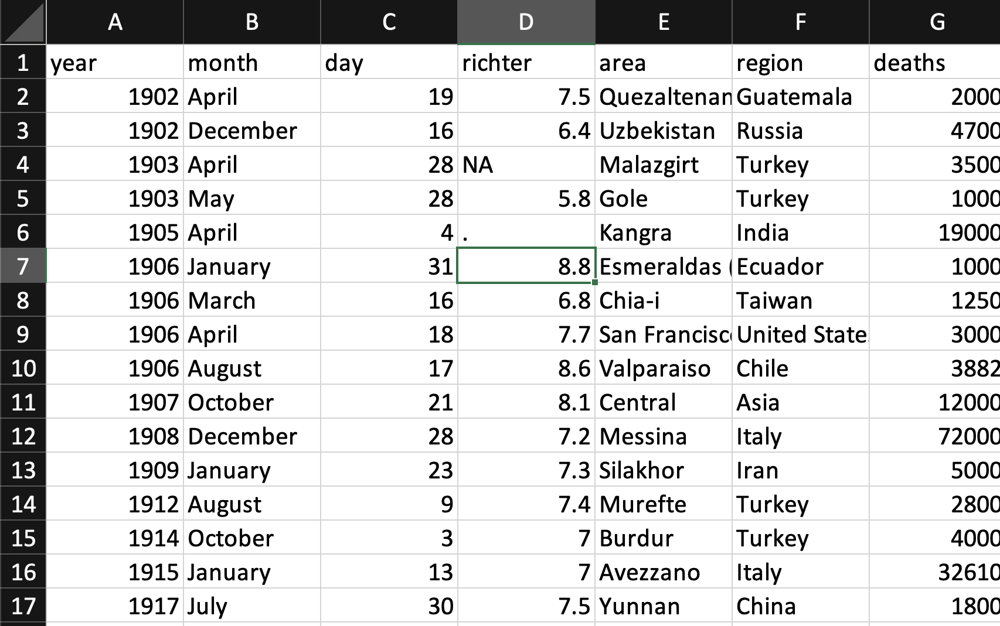

```{r packages, echo=FALSE, message=FALSE, warning=FALSE}
library(tidyverse)
library(readxl)
library(skimr)
library(knitr)
library(DT)
library(here)
```

class: middle

# Reading rectangular data into R

---

class: middle

.pull-left[
```{r echo=FALSE, out.width="80%"}
knitr::include_graphics("img/readr.png")
```
]
.pull-right[
```{r echo=FALSE, out.width="80%"}
knitr::include_graphics("img/readxl.png")
```
]

---

.pull-left[
## readr

- `read_csv()` - comma delimited files
- `read_csv2()` - semicolon separated files (common in countries where , is used as the decimal place)
- `read_tsv()` - tab delimited files
- `read_delim()` - reads in files with any delimiter
- `read_fwf()` - fixed width files
- ...
]

--
.pull-right[
## readxl

- `read_excel()` - read xls or xlsx files
- ...
]

---

## Reading data

```{r}
earthquakes <- read_csv(file = "data/earthquakes.csv")
earthquakes
```

---

## Writing data

- Write a file

```{r cache=TRUE}
earthquakes_subset <- earthquakes %>%
  select(-richter, -deaths)

write_csv(earthquakes_subset, file = "data/earthquakes-subset.csv")
```

---

## Read it back in to inspect

```{r}
read_csv("data/earthquakes-subset.csv")
```


---

.your-turn[
### .hand[Your turn!]

- GitHub Repo Links: Blackboard Week 9 Content > Weekly Content > Clone Unit-5 Repo
- RStudio Cloud > `lab 05 - Import and Recode earthquakes` > open `lab-05-import-recode.Rmd` and knit.
  
  
- **Complete Exercises 1-4**:
- Read in the `earthquakes` dataset in parts, using different read functions
- Reassemble using join functions 
- Write out the joined dataset to `earthquakes-tidyverse.csv` to `data/`.

]

---

class: middle

# Variable names

---

## Data with bad names

```{r message=FALSE}
earthquakes_badnames <- read_csv("data/earthquakes-badnames.csv")
names(earthquakes_badnames)
```

--

... but R doesn't allow spaces in variable names

```{r error=TRUE}
ggplot(earthquakes_badnames, aes(x = year, y = total deaths)) +
  geom_point()
```

---

## Option 1 - Define column names

.small[
```{r}
earthquakes_correct_names <- read_csv("data/earthquakes-badnames.csv", 
                                      col_names = c("year", "month", "day", 
                                                    "richter", "area","region", 
                                                    "deaths")
                                      )
names(earthquakes_correct_names)
```
]

---

## Option 2 - Format text to snake_case

```{r warning=FALSE}
earthquakes_clean_names <- read_csv("data/earthquakes-badnames.csv") %>%
  janitor::clean_names()

names(earthquakes_clean_names)
```

---

class: middle

# Variable types

---

.question[
Which type is `richter``? Why?
]

.pull-left[
```{r echo=FALSE, out.width="90%"}

```
]
.pull-right[
```{r echo=FALSE}
read_csv("data/earthquakes-na.csv") %>% print(n = 10)
```
]

---

## Option 1. Explicit NAs

```{r eval=FALSE}
read_csv("data/earthquakes-na.csv", 
         na = c("NA", ".")) #<<
``` 

.pull-left[
```{r echo=FALSE, out.width="100%"}

```
]
.pull-right[
```{r echo=FALSE,message=FALSE,}
read_csv("data/earthquakes-na.csv", 
  na = c("NA", ".")) %>% #<<
  print(n = 10) 
```
]

---

## Option 2. Specify column types

```{r eval=FALSE}
read_csv("data/earthquakes-na.csv", col_types = list(col_integer(), # year
                                            col_character(), # month
                                            col_integer(), # day
                                            col_double(), # richter
                                            col_character(), # area
                                            col_character(), # region
                                            col_integer() # deaths
                                            ))
```

```{r echo=FALSE}
read_csv("data/earthquakes-na.csv", col_types = list(col_integer(), 
                                            col_character(),
                                            col_integer(), 
                                            col_double(), 
                                            col_character(), 
                                            col_character(), 
                                            col_integer() )) %>%
  print(n = 10)
```

---

## Column types

.small[
**type function**  | **data type**
------------------ | -------------
`col_character()`  | character
`col_date()`       | date
`col_datetime()`   | POSIXct (date-time)
`col_double()`     | double (numeric)
`col_factor()`     | factor
`col_guess()`      | let readr guess (**default**)
`col_integer()`    | integer
`col_logical()`    | logical
`col_number()`     | numbers mixed with non-number characters
`col_numeric()`    | double or integer
`col_skip()`       | do not read
`col_time()`       | time
]

---

## Review: How to correct a wrongly-entered value?

```{r}
earthquakes_bad_value <- read_csv("data/earthquakes-character-value.csv")
glimpse(earthquakes_bad_value)
```

---

## Review: How to correct a wrongly-entered value?

```{r warning=FALSE}
earthquakes_OK_value <- earthquakes_bad_value %>%
  mutate(richter = case_when(     #<<
    richter == "seven" ~ "7",      #<<
    TRUE ~ richter),     #<<
    richter = as.numeric(richter))      #<<

glimpse(earthquakes_OK_value) 
```

---

## More review: Factor orders

.question[
What order are the levels of `month` listed in?
]

```{r}
earthquakes %>%
  count(month)
```

**What package/function could we use to correct this?** 

---

## Make `month` class factor

.pull-left-wide[
```{r warning=FALSE}
earthquakes_relevel <- earthquakes %>%
  mutate(month = fct_relevel(month, "January", "February", "March", #<<
                             "April", "May", "June", "July", "August", #<<
                             "September", "October", "November", "December")) #<<

earthquakes_relevel %>%
  count(month)
```
]

---

## Putting it altogether

```{r warning=FALSE}
earthquakes_final <- read_csv("data/earthquakes-badnames-na.csv", na = c(".", "NA")) %>%
  janitor::clean_names() %>%
  mutate(
    richter = case_when(
      richter == "seven" ~ "7",
      TRUE ~ richter
      ),
    richter = as.numeric(richter),
    month = fct_relevel(month, "January", "February", "March",
                             "April", "May", "June", "July", "August",
                             "September", "October", "November", "December")) 
```

---

## Does it look correct now?

```{r warning=FALSE}
earthquakes_final
```

---

## Write out, and read back in

```{r}
write_csv(earthquakes_final, file = "data/earthquakes-final.csv")

earthquakes_final <- read_csv("data/earthquakes-final.csv")
```

---

.question[
What happened to `month` again?
]

```{r}
earthquakes_final %>%
  count(month)
```

---

## RDS files: R data structures

- CSVs can be unreliable for saving interim results if there is specific variable type information you want to hold on to.
- An alternative is RDS files, you can read and write them with `read_rds()` and `write_rds()`, respectively.

```{r eval=FALSE}
read_rds(path)
write_rds(x, path)
```

---

## Out and back in, take 2

```{r warning=FALSE, echo = FALSE, message = FALSE}
earthquakes_final <- read_csv("data/earthquakes-badnames-na.csv", na = c(".", "NA")) %>%
  janitor::clean_names() %>%
  mutate(
    richter = case_when(
      richter == "seven" ~ "7",
      TRUE ~ richter
      ),
    richter = as.numeric(richter),
    month = fct_relevel(month, "January", "February", "March",
                             "April", "May", "June", "July", "August",
                             "September", "October", "November", "December")) 
```

```{r}
write_rds(earthquakes_final, file = "data/earthquakes-final.rds")

earthquakes_final <- read_rds("data/earthquakes-final.rds")

earthquakes_final %>%
  count(month)
```

---

class: middle

# Other types of data

---

## Other types of data

- **googlesheets4:** Google Sheets
- **haven**: SPSS, Stata, and SAS files
- **DBI**, along with a database specific backend (e.g. RMySQL, RSQLite, RPostgreSQL etc): allows you to run SQL queries against a database and return a data frame
- **jsonline**: JSON
- **xml2**: xml
- **rvest**: web scraping
- **httr**: web APIs
- **sparklyr**: data loaded into spark

---

.your-turn[
### .hand[Your turn!]
.midi[
- Continue `lab 05 - importing and recoding earthquakes`
- Complete exercises 5-10
]
]


---

.center[
.large[
This class content was built from the Data Science in a Box source materials.
https://datasciencebox.org/index.html
]
]

