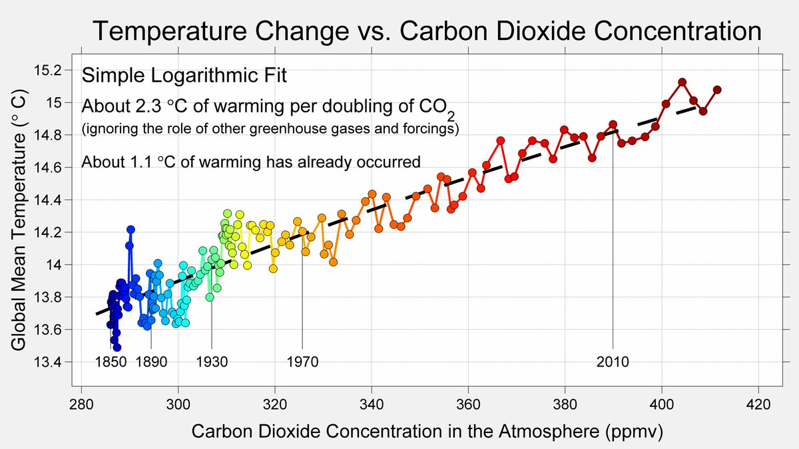

```{r packages, echo = FALSE, message=FALSE, warning=FALSE}
library(tidyverse)
library(tidymodels)
library(ggtext)
library(knitr)
library(kableExtra)
library(lubridate)
set.seed(1234)
options(dplyr.print_min = 10, dplyr.print_max = 6)
theme_bw <- theme_bw() + theme(axis.text=element_text(size=20),
                               axis.title = element_text(size = 20))
```

class: middle

# Models with numerical explanatory variables

---

## Data: Morgan-Monroe State Forest Carbon Uptake

```{r message=FALSE}
monroe_fluxes <- read_csv("data/amf-us-mms.csv", na = c("-9999"), skip = 2)
```

```{r echo = F}
monroe_fluxes <- monroe_fluxes %>% 
  select(timestamp = TIMESTAMP_END, 
         fco2 = FC_1_1_1,
         ustar = USTAR_1_1_1, 
         ta = TA_1_1_1, 
         le = LE_1_1_1,
         p = P_1_1_1,
         sw_in = SW_IN_1_1_1,
         rh = RH_1_1_1,
         pa = PA_1_1_1,
      ) 

monroe_fluxes <- monroe_fluxes %>% 
  mutate(date = ymd_hm(timestamp)) %>%
  relocate(date) %>% 
  select(-timestamp)
```

- Number of observations: `r nrow(monroe_fluxes)`
- Number of variables: `r ncol(monroe_fluxes)`

---

## Goal: Predict CO2 flux (`fco2`) from solar radiation (`sw_in`)

$$\widehat{fco2}_{i} = \beta_0 + \beta_1 \times sw.in_{i}$$

```{r fco2-plot, echo=FALSE, warning=FALSE, fig.height = 6}
monroe_fluxes %>% 
  filter(date > "2020-07-01" & date < "2020-07-05") %>%  #<<
  ggplot(aes(x = sw_in, y = fco2)) +
  geom_point() +
  geom_smooth(method = "lm") +
  labs(
    title = "Half-hourly CO2 flux vs. incoming solar radiation",
    subtitle = "For 2020, at Morgan Monroe State Forest",
    x = expression("Radiation (W m"^{-2}*")"),
    y =  expression("Net CO"[2]*" Flux (nmol m"^{-2}*" s"^{-1}*")")) +
  theme_bw
```


---

```{r out.width="98%", echo=FALSE}
knitr::include_graphics("img/tidymodels.png")
```

---

## Step 1: Specify model

```{r}
linear_reg()
```

---

## Step 2: Set model fitting *engine*

```{r}
linear_reg() %>%
  set_engine("lm") # lm: linear model
```

---

## Step 3: Fit model & estimate parameters

... using **formula syntax**

```{r fit-model}
linear_reg() %>%
  set_engine("lm") %>%
  fit(fco2 ~ sw_in, data = monroe_fluxes)
```

---

## A closer look at model output

```{r ref.label="fit-model", echo=FALSE}
```

.large[
$$\widehat{fco2}_{i} = 1.71303 - 0.01871 \times sw.in_{i}$$
]

---

## A tidy look at model output

```{r}
linear_reg() %>%
  set_engine("lm") %>%
  fit(fco2 ~ sw_in, data = monroe_fluxes) %>%
  tidy()
```

.large[
$$\widehat{fco2}_{i} = 1.713 - 0.019 \times sw.in_{i}$$
]

---

## Slope and intercept

.large[
$$\widehat{fco2}_{i} = 1.713 + 0.019 \times sw.in_{i}$$
]

--

- **Slope:** For each additional watt per m2 in incoming solar radiation, the CO2 flux is expected to be more negative, on average, by 0.019 nmol m-2 s-1.

--
- **Intercept:** When solar radiation is 0, CO2 flux is expected to be (+)1.713 nmol m-2 s-1.
(Does this make sense?)

---

## Correlation does not imply causation

Remember this when interpreting model coefficients

```{r echo=FALSE, out.width="80%"}

```


---

class: middle

# Parameter estimation

---

## Linear model with a single predictor

- We're interested in $\beta_0$ (population parameter for the intercept) and $\beta_1$ (population parameter for the slope) in the following model:

$$\hat{y}_{i} = \beta_0 + \beta_1~x_{i}$$

--
- Tough luck, you can't have them...

--
- So we use sample statistics to estimate them:

$$\hat{y}_{i} = b_0 + b_1~x_{i}$$

---

## Least squares regression

- The regression line minimizes the sum of squared residuals.

--
- If $e_i = y_i - \hat{y}_i$, then, the regression line minimizes 
$\sum_{i = 1}^n e_i^2$.

---

## Visualizing residuals

```{r vis-res-1, echo=FALSE, fig.height = 6}
fco2_swin_fit <- linear_reg() %>%
  set_engine("lm") %>%
  fit(fco2 ~ sw_in, data = filter(monroe_fluxes, date > "2020-07-01" & date < "2020-07-05"))

fco2_swin_fit_tidy <- tidy(fco2_swin_fit$fit) 
fco2_swin_fit_aug  <- augment(fco2_swin_fit$fit) %>%
  mutate(res_cat = ifelse(.resid > 0, TRUE, FALSE))

p <- ggplot(data = fco2_swin_fit_aug, 
            aes(x = sw_in, y = fco2)) +
  geom_point(alpha = 0.2) + 
  labs(
    title = "Half-hourly CO2 flux vs. incoming solar radiation",
    subtitle = "For 2020, at Morgan Monroe State Forest",
    x = expression("Radiation (W m"^{-2}*")"),
    y =  expression("Net CO"[2]*" Flux (nmol m"^{-2}*" s"^{-1}*")")) +
  theme(plot.subtitle = element_text(colour = "#E48957", face = "bold", size = rel(1.5)))
p +
  theme_bw
```

---

## Visualizing residuals (cont.)

```{r vis-res-2, echo=FALSE, fig.height = 6}
p <- p + 
  geom_smooth(method = "lm", color = "#8E2C90", se = FALSE) +
  geom_point(mapping = aes(y = .fitted), color = "#E48957") +
  labs(subtitle = "Data + least squares line") +
  theme_bw
p
```

---

## Visualizing residuals (cont.)

```{r vis-res-3, echo = FALSE, fig.height = 6}
p + 
  geom_segment(mapping = aes(xend = sw_in, yend = .fitted), color = "#E48957", alpha = 0.4) +
  labs(subtitle = "Data + least squares line + residuals") +
  theme_bw
```

---

## Final Comments: Properties of least squares regression

- The regression line goes through the center of mass point, the coordinates corresponding to average $x$ and average $y$, $(\bar{x}, \bar{y})$:  

$$\bar{y} = b_0 + b_1 \bar{x} ~ \rightarrow ~ b_0 = \bar{y} - b_1 \bar{x}$$

--
- The slope has the same sign as the correlation coefficient: $b_1 = r \frac{s_y}{s_x}$

--
- The sum of the residuals is zero: $\sum_{i = 1}^n e_i = 0$

--
- The residuals and $x$ values are uncorrelated

---

class: middle

# Models with categorical explanatory variables

---

## Categorical predictor with 2 levels

.pull-left-narrow[
.small[
```{r echo=FALSE}
monroe_fluxes %>% 
    mutate(season = ifelse(date < "2020-04-01", "winter", NA),
         season = ifelse(date < "2020-07-01" & date > "2020-04-01", "spring", season),
         season = ifelse(date < "2020-10-01" & date > "2020-07-01", "summer", season),
         season = ifelse(date < "2020-12-31" & date > "2020-10-01", "fall", season)) %>% 
  filter(season %in% c("winter", "summer")) %>% 
  select(date, fco2, season) %>%
  print(n = 20)
```
]
]
.pull-right-wide[
- `season = 0`: Summer
- `season = 1`: Winter
]

```{r echo=FALSE}
monroe_fluxes <- monroe_fluxes %>% 
    mutate(season = ifelse(date < "2020-04-01", "winter", NA),
         season = ifelse(date < "2020-07-01" & date > "2020-04-01", "spring", season),
         season = ifelse(date < "2020-10-01" & date > "2020-07-01", "summer", season),
         season = ifelse(date < "2020-12-31" & date > "2020-10-01", "fall", season)) %>% 
  mutate(winter = ifelse(season == "winter", 1, 0))
```

---

## CO2 flux and winter (vs. summer) season

```{r ht-lands-fit}
linear_reg() %>%
  set_engine("lm") %>%
  fit(fco2 ~ factor(winter), data = filter(monroe_fluxes, season %in% c("summer", "winter"))) %>%
  tidy()
```

---

## CO2 flux and winter (vs. summer) season

$$\widehat{fco2} = -5.223133 + 3.562131~winter$$

- **Slope:** CO2 flux in the winter are expected, on average, to be 3.562 nmol m-2 s-1 more positive than in summer (less co2 uptake)
  - Compares baseline level (`winter = 0`) to the other level (`winter = 1`)
    
- **Intercept:** CO2 flux during summer are expected, on average, to -5.223133 nmol m-2 s-1

---

## Relationship between CO2 flux and all seasons

```{r co2-flux-season}
linear_reg() %>%
  set_engine("lm") %>%
  fit(fco2 ~ season, data = monroe_fluxes) %>%
  tidy()
```

---

## Dummy variables

```{r ref.label="co2-flux-season", echo = FALSE}
```

- When the categorical explanatory variable has many levels, they're encoded to **dummy variables**
- Each coefficient describes the expected difference between a season compared to the baseline level (season)

---

## Categorical predictor with 3+ levels

### R will create new "dummy" variables automatically

.pull-left-wide[
```{r echo=FALSE, warning = F}
dummy_df <- monroe_fluxes %>% 
  select(season) %>% 
  group_by(season) %>% 
  filter(!is.na(season)) %>% 
  sample_n(1) %>%
  mutate(
    spring = as.integer(ifelse(season == "spring", 1L, 0)),
    summer    = as.integer(ifelse(season == "summer", 1L, 0)),
    fall    = as.integer(ifelse(season == "fall", 1L, 0)),
    winter    = as.integer(ifelse(season == "winter", 1L, 0))
  )

dummy_df %>%
  kable(align = "lcccccc") %>%
  kable_styling() %>%
  column_spec(2, width = "10em", background = spec_color(dummy_df$fall[1:5], end = 0.8), color = "white") %>%
  column_spec(3, width = "10em", background = spec_color(dummy_df$spring[1:5], end = 0.8), color = "white") %>%
  column_spec(4, width = "10em", background = spec_color(dummy_df$summer[1:5], end = 0.8), color = "white") %>%
  column_spec(5, width = "10em", background = spec_color(dummy_df$winter[1:5], end = 0.8), color = "white") 
```
]

---

## Relationship between CO2 flux and season

.small[
```{r ref.label="co2-flux-season", echo=FALSE}
```

- **Fall season** CO2 fluxes are expected, on average, to be 0.8394269 nmol m-2 s-1.
- **Spring season** CO2 fluxes are expected, on average, to be 3.0774139 nmol m-2 s-1 more negative than in Fall.
- **Summer season** CO2 fluxes are expected, on average, to be 6.0625599 nmol m-2 s-1 more negative than in Fall.
- **Winter season** CO2 fluxes are expected, on average, to be 2.5004288 nmol m-2 s-1 more negative than in Fall.

]
---

# Summary 1: 

- When the explanatory variable is numerical: 

```{r}
linear_reg() %>%
  set_engine("lm") %>%
  fit(fco2 ~ sw_in, data = monroe_fluxes) %>%
  tidy()
```

---

# Summary 2: 

- When the explanatory variable is categorical with two levels (winter vs. summer) **the baseline is easy to tell because it's whatever is not shown in the second coefficient**

```{r ht-lands-fit-2}
linear_reg() %>%
  set_engine("lm") %>%
  fit(fco2 ~ factor(winter), data = filter(monroe_fluxes, season %in% c("summer", "winter"))) %>%
  tidy()
```

---

# Summary 3: 

- When the explanatory variable is categorical with more than 2 levels (all four seasons) **dummy variables (columns) are created "under the hood"**

```{r co2-flux-season-2}
linear_reg() %>%
  set_engine("lm") %>%
  fit(fco2 ~ season, data = monroe_fluxes) %>%
  tidy()
```

---

.center[
.large[
This class content was built from the Data Science in a Box source materials.
https://datasciencebox.org/index.html
]
]
