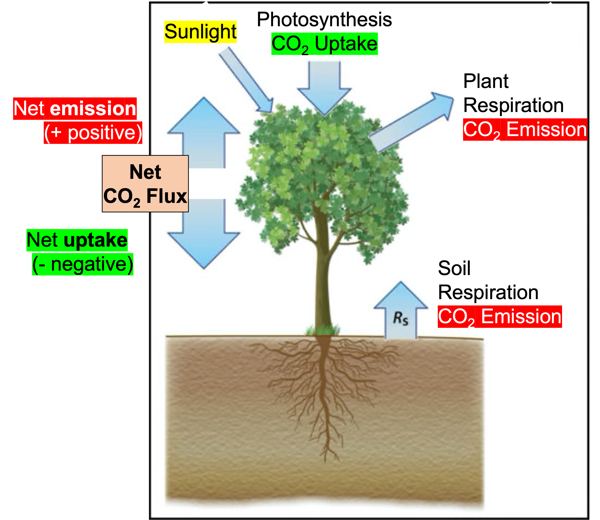

```{r packages, echo = FALSE, message=FALSE, warning=FALSE}
library(tidyverse)
library(tidymodels)
library(lubridate)
set.seed(1234)
theme_bw <- theme_bw() + theme(axis.text=element_text(size=20),
                               axis.title = element_text(size = 20))
```

class: middle

# What is a model?

---

## Modelling

- Use models to explain the relationship between variables and to make predictions
- For now we will focus on **linear** models (but remember there are *many* *many* other types of models too!)

.pull-left[
```{r echo = FALSE, out.width = "75%"}
df1 <- tibble(x = 1:100, y = x + rnorm(100, mean = 0, sd = 5))
ggplot(df1, aes(x = x, y = y)) +
  geom_point() +
  geom_smooth(method = "lm", color = "#E48957", se = FALSE) +
  labs(title = "Linear", x = NULL, y = NULL) +
  theme(
    axis.text  = element_blank(),
    axis.ticks = element_blank()
    )
```
]
.pull-right[
```{r echo = FALSE, out.width = "75%"}
df2 <- tibble(x = seq(-6, 5.9, 0.1), y = (1 / (1+exp(-2*x))) + rnorm(120, mean = 0, sd = 0.1))
ggplot(df2, aes(x = x, y = y)) +
  geom_point() +
  geom_smooth(method = "loess", color = "#8E2C90", se = FALSE) +
  labs(title = "Non-linear", x = NULL, y = NULL) +
  theme(
    axis.text  = element_blank(),
    axis.ticks = element_blank()
    )
```
]

---
# The breathing of the biosphere

```{r out.width="65%", echo=FALSE}

```

Photo Credit: Tyler Roman

---

## Data: Morgan-Monroe State Forest Carbon Uptake

```{r message=FALSE}
monroe_fluxes <- read_csv("data/amf-us-mms.csv", na = c("-9999"), skip = 2)
```

```{r echo = F}
monroe_fluxes <- monroe_fluxes %>% 
  select(timestamp = TIMESTAMP_END, 
         fco2 = FC_1_1_1,
         ustar = USTAR_1_1_1, 
         ta = TA_1_1_1, 
         le = LE_1_1_1,
         p = P_1_1_1,
         sw_in = SW_IN_1_1_1,
         rh = RH_1_1_1,
         pa = PA_1_1_1,
      ) 
```


- Source: AmeriFlux Network
- Site Investigators: Kim Novick and Rich Phillips (Indiana University)
- `r nrow(monroe_fluxes)` half-hourly measurements of ecosystem-atmosphere exchanges
- That's `r nrow(monroe_fluxes)/(48*365)` years of data

---

# Data collection: Tower-based eddy covariance

```{r out.width="65%", echo=FALSE}
knitr::include_graphics("img/monroe-tower.jpeg")
```

Photo Credit: Tyler Roman

**YouTube**

---

# What does the tower data look like?

```{r look-at-data}
glimpse(monroe_fluxes)
```

--

```{r timestamp}
monroe_fluxes$timestamp[1] %>% as.character()
monroe_fluxes$timestamp[197568] %>% as.character()
```

--

**197,568 half hours from Jan 01, 1999 at 1AM to July 16, 2021 at midnight!**

---

## Process we're interested in:
### Ecosystem CO2 flux (fco2) (exchange rate of CO2 between ecosystem and atmosphere)

```{r out.width="40%", echo=FALSE}

```

---
# What does CO2 flux look like in our Morgan Monroe State Forest?

Try plotting a histogram of `fco2`

```{r histogram, eval = F}
monroe_fluxes %>% 
  ggplot(aes(fco2)) +
  geom_histogram() + 
  labs(x = expression("Net CO"[2]*" Flux (nmol m"^{-2}*" s"^{-1}*")")) +
  theme_bw 
```

---
# What does CO2 flux look like in our Morgan Monroe State Forest?

```{r histogram-2, echo = F, fig.width=12, fig.height=6, warning = F, message = F}
monroe_fluxes %>% 
  ggplot(aes(fco2)) +
  geom_histogram() + 
  labs(x = expression("Net CO"[2]*" Flux (nmol m"^{-2}*" s"^{-1}*")")) +
  theme_bw 
```


---
# What does CO2 flux look like in our Morgan Monroe State Forest?

First, convert to date-time

```{r get-date-time}
monroe_fluxes <- monroe_fluxes %>% 
  mutate(date = ymd_hm(timestamp)) %>%  #<<
  relocate(date) %>% 
  select(-timestamp)
head(monroe_fluxes, 5)
```

---
# What does an ecosystem's breathing look like in our Morgan Monroe State Forest?

Try plotting `fco2` over time

```{r plot-gpp, warning = F, eval = F}
monroe_fluxes %>% 
  mutate(sign = ifelse(fco2 >= 0, "net emission", "net uptake")) %>% 
  ggplot(aes(date, fco2, color = sign)) +
  geom_point() +
  theme_bw +
  labs(y = expression("Net CO"[2]*" Flux (nmol m"^{-2}*" s"^{-1}*")")) +
  scale_color_manual(values = c("red", "dark green"))
```
---
# What does an ecosystem's breathing look like in our Morgan Monroe State Forest?

```{r plot-gpp-2, warning = F, echo = F, fig.width=12, fig.height=6}
monroe_fluxes %>% 
  mutate(sign = ifelse(fco2 >= 0, "net emission", "net uptake")) %>% 
  ggplot(aes(date, fco2, color = sign)) +
  geom_point() +
  theme_bw +
  labs(y = expression("Net CO"[2]*" Flux (nmol m"^{-2}*" s"^{-1}*")")) +
  scale_color_manual(values = c("red", "dark green"))
```
---

# How does the data look for one year? (keep it simple!)

```{r plot-gpp-year, warning = F, eval = F}
monroe_fluxes %>% 
  filter(date > "2020-01-01" & date < "2021-01-01") %>%  #<<
  mutate(sign = ifelse(fco2 >= 0, "net emission", "net uptake")) %>% 
  ggplot(aes(date, fco2, color = sign)) +
  geom_point() +
  theme_bw +
  labs(y = expression("Net CO"[2]*" Flux (nmol m"^{-2}*" s"^{-1}*")")) +
  scale_color_manual(values = c("red", "dark green"))
```

---

# How does the data look for one year? (keep it simple!)

```{r plot-gpp-year-2, warning = F, echo = F}
monroe_fluxes %>% 
  filter(date > "2020-01-01" & date < "2021-01-01") %>%  #<<
  mutate(sign = ifelse(fco2 >= 0, "net emission", "net uptake")) %>% 
  ggplot(aes(date, fco2, color = sign)) +
  geom_point() +
  theme_bw +
  labs(y = expression("Net CO"[2]*" Flux (nmol m"^{-2}*" s"^{-1}*")")) +
  scale_color_manual(values = c("red", "dark green"))
```

**YouTube Video**

---

# What about just for one 3-day period? (super simple!)

```{r plot-gpp-day, eval = F}
monroe_fluxes %>% 
  filter(date > "2020-07-01" & date < "2020-07-05") %>% #<<
  ggplot(aes(date, fco2)) +
  geom_hline(yintercept = 0) +
  geom_point() +
  geom_line(aes(date, fco2)) +
  theme_bw +
  labs(y = expression("Net CO"[2]*" Flux (nmol m"^{-2}*" s"^{-1}*")")) +
  scale_color_manual(values = c("red", "dark green"))
```
---

# What about just for one 3-day period? (super simple!)

```{r plot-gpp-day-2, eval = T, echo = F}
monroe_fluxes %>% 
  filter(date > "2020-07-01" & date < "2020-07-05") %>% #<<
  ggplot(aes(date, fco2)) +
  geom_hline(yintercept = 0) +
  geom_point() +
  geom_line(aes(date, fco2)) +
  theme_bw +
  labs(y = expression("Net CO"[2]*" Flux (nmol m"^{-2}*" s"^{-1}*")")) +
  scale_color_manual(values = c("red", "dark green"))
```

We now have a good handle on what our data is doing.
    
Next, we might ask: **Why does it vary in this way?**

---

class: middle

# Modeling the relationship between variables

---

## Models as functions

- We can represent relationships between variables using **functions**
- A function is a mathematical concept: the relationship between an output and one or more inputs
  - Plug in the inputs and receive back the output
  - Example: The formula $y = 3x + 7$ is a function with input $x$ and output $y$. If $x$ is $5$, $y$ is $22$, $y = 3 \times 5 + 7 = 22$

---

## fco2 as a function of...

---

## fco2 as a function of incoming solar radiation

```{r co2-flux-plot-2, echo = F}
monroe_fluxes %>% 
  filter(date > "2020-07-01" & date < "2020-07-05") %>%  #<<
  ggplot(aes(x = sw_in, y = fco2)) +
  geom_point() +
  geom_smooth(method = "lm") +
  labs(
    title = "Half-hourly CO2 flux vs. incoming solar radiation",
    subtitle = "For 2020, at Morgan Monroe State Forest",
    x = expression("Radiation (W m"^{-2}*")"),
    y =  expression("Net CO"[2]*" Flux (nmol m"^{-2}*" s"^{-1}*")")) +
  theme_bw
```

---

## fco2 as a function of incoming solar radiation

```{r co2-flux-plot, fig.show="hide"}
monroe_fluxes %>% 
  filter(date > "2020-07-01" & date < "2020-07-05") %>%  #<<
  ggplot(aes(x = sw_in, y = fco2)) +
  geom_point() +
  geom_smooth(method = "lm") +
  labs(
    title = "Half-hourly CO2 flux vs. incoming solar radiation",
    subtitle = "For 2020, at Morgan Monroe State Forest",
    x = expression("Radiation (W m"^{-2}*")"),
    y =  expression("Net CO"[2]*" Flux (nmol m"^{-2}*" s"^{-1}*")")) +
  theme_bw
```

---

## ... without the measure of uncertainty

```{r co2-flux-plot-no-se-2, warning=FALSE, echo = F}
monroe_fluxes %>% 
  filter(date > "2020-07-01" & date < "2020-07-05") %>% 
  ggplot(aes(x = sw_in, y = fco2)) +
  geom_point() +
  geom_smooth(method = "lm", se = FALSE) + #<<
  labs(
    title = "Half-hourly CO2 flux vs. incoming solar radiation",
    subtitle = "For 2020, at Morgan Monroe State Forest",
    x = expression("Radiation (W m"^{-2}*")"),
    y =  expression("Net CO"[2]*" Flux (nmol m"^{-2}*" s"^{-1}*")")) +
  theme_bw
```

---

## ... without the measure of uncertainty

```{r co2-flux-plot-no-se, fig.show="hide", warning=FALSE}
monroe_fluxes %>% 
  filter(date > "2020-07-01" & date < "2020-07-05") %>% 
  ggplot(aes(x = sw_in, y = fco2)) +
  geom_point() +
  geom_smooth(method = "lm", se = FALSE) + #<<
  labs(
    title = "Half-hourly CO2 flux vs. incoming solar radiation",
    subtitle = "For 2020, at Morgan Monroe State Forest",
    x = expression("Radiation (W m"^{-2}*")"),
    y =  expression("Net CO"[2]*" Flux (nmol m"^{-2}*" s"^{-1}*")")) +
  theme_bw
```

---

## ... with different cosmetic choices

```{r co2-flux-plot-cosmetics-2, warning=FALSE, echo = F}
monroe_fluxes %>% 
  filter(date > "2020-07-01" & date < "2020-07-05") %>% 
  ggplot(aes(x = sw_in, y = fco2)) +
  geom_point() +
  geom_smooth(method = "lm", se = FALSE,
              color = "purple", linetype = 2, size = 3) + #<<
  labs(
    title = "Half-hourly CO2 flux vs. incoming solar radiation",
    subtitle = "For 2020, at Morgan Monroe State Forest",
    x = expression("Radiation (W m"^{-2}*")"),
    y =  expression("Net CO"[2]*" Flux (nmol m"^{-2}*" s"^{-1}*")")) +
  theme_bw
```

---

## ... with different cosmetic choices

```{r co2-flux-plot-cosmetics, fig.show="hide", warning=FALSE}
monroe_fluxes %>% 
  filter(date > "2020-07-01" & date < "2020-07-05") %>% 
  ggplot(aes(x = sw_in, y = fco2)) +
  geom_point() +
  geom_smooth(method = "lm", se = FALSE,
              color = "purple", linetype = 2, size = 3) + #<<
  labs(
    title = "Half-hourly CO2 flux vs. incoming solar radiation",
    subtitle = "For 2020, at Morgan Monroe State Forest",
    x = expression("Radiation (W m"^{-2}*")"),
    y =  expression("Net CO"[2]*" Flux (nmol m"^{-2}*" s"^{-1}*")")) +
  theme_bw
```

---

## Other smoothing methods: gam

```{r co2-flux-plot-gam-2,  warning=FALSE, echo = F}
monroe_fluxes %>% 
  filter(date > "2020-07-01" & date < "2020-07-05") %>% 
  ggplot(aes(x = sw_in, y = fco2)) +
  geom_point() +
  geom_smooth(method = "gam", se = FALSE, #<<
              color = "purple") + 
  labs(
    title = "Half-hourly CO2 flux vs. incoming solar radiation",
    subtitle = "For 2020, at Morgan Monroe State Forest",
    x = expression("Radiation (W m"^{-2}*")"),
    y =  expression("Net CO"[2]*" Flux (nmol m"^{-2}*" s"^{-1}*")")) +
  theme_bw
```

---

## Other smoothing methods: gam

```{r co2-flux-plot-gam, fig.show="hide", warning=FALSE}
monroe_fluxes %>% 
  filter(date > "2020-07-01" & date < "2020-07-05") %>% 
  ggplot(aes(x = sw_in, y = fco2)) +
  geom_point() +
  geom_smooth(method = "gam", se = FALSE, #<<
              color = "purple") + 
  labs(
    title = "Half-hourly CO2 flux vs. incoming solar radiation",
    subtitle = "For 2020, at Morgan Monroe State Forest",
    x = expression("Radiation (W m"^{-2}*")"),
    y =  expression("Net CO"[2]*" Flux (nmol m"^{-2}*" s"^{-1}*")")) +
  theme_bw
```

---

## Other smoothing methods: loess

```{r co2-flux-plot-loess-2, warning=FALSE, echo = F}
monroe_fluxes %>% 
  filter(date > "2020-07-01" & date < "2020-07-05") %>% 
  ggplot(aes(x = sw_in, y = fco2)) +
  geom_point() +
  geom_smooth(method = "loess", se = FALSE, #<<
              color = "purple") + 
  labs(
    title = "Half-hourly CO2 flux vs. incoming solar radiation",
    subtitle = "For 2020, at Morgan Monroe State Forest",
    x = expression("Radiation (W m"^{-2}*")"),
    y =  expression("Net CO"[2]*" Flux (nmol m"^{-2}*" s"^{-1}*")")) +
  theme_bw
```

---

## Other smoothing methods: loess

```{r co2-flux-plot-loess, fig.show="hide", warning=FALSE}
monroe_fluxes %>% 
  filter(date > "2020-07-01" & date < "2020-07-05") %>% 
  ggplot(aes(x = sw_in, y = fco2)) +
  geom_point() +
  geom_smooth(method = "loess", se = FALSE, #<<
              color = "purple") + 
  labs(
    title = "Half-hourly CO2 flux vs. incoming solar radiation",
    subtitle = "For 2020, at Morgan Monroe State Forest",
    x = expression("Radiation (W m"^{-2}*")"),
    y =  expression("Net CO"[2]*" Flux (nmol m"^{-2}*" s"^{-1}*")")) +
  theme_bw
```

---

## Vocabulary

- **Response variable:** Variable whose behavior or variation you are trying to understand, on the y-axis

--
- **Explanatory variables:** Other variables that you want to use to explain the variation in the response, on the x-axis

--
- **Predicted value:** Output of the **model function**
  - The model function gives the typical (expected) value of the response variable *conditioning* on the explanatory variables
  
--
- **Residuals:** A measure of how far each case is from its predicted value (based on a particular model)
  - Residual = Observed value - Predicted value
  - Tells how far above/below the expected value each case is

---

## Residuals

```{r co2-flux-plot-residuals-2,  warning=FALSE, echo = F}
co2_flux_fit <- linear_reg() %>%
  set_engine("lm") %>%
  fit(fco2 ~ sw_in, data = filter(monroe_fluxes, date > "2020-07-01" & date < "2020-07-05"))

co2_flux_fit_tidy <- tidy(co2_flux_fit$fit) 
co2_flux_fit_aug  <- augment(co2_flux_fit$fit) %>%
  mutate(res_cat = ifelse(.resid > 0, TRUE, FALSE))

ggplot(data = co2_flux_fit_aug) +
  geom_point(aes(x = sw_in, y = fco2, color = res_cat)) +
  geom_line(aes(x = sw_in, y = .fitted), size = 0.75, color = "#8E2C90") + 
    labs(
    title = "Half-hourly CO2 flux vs. incoming solar radiation",
    subtitle = "For 2020, at Morgan Monroe State Forest",
    x = expression("Radiation (W m"^{-2}*")"),
    y =  expression("Net CO"[2]*" Flux (nmol m"^{-2}*" s"^{-1}*")")) +
  guides(color = FALSE) +
  scale_color_manual(values = c("#260b27", "#e6b0e7")) +
  geom_text(aes(x = 0, y = 20), label = "Positive residual", color = "#e6b0e7", hjust = 0, size = 8) +
  geom_text(aes(x = 150, y = -30), label = "Negative residual", color = "#260b27", hjust = 0, size = 8) +
  theme_bw
```

---

## Residuals

```{r co2-flux-plot-residuals, fig.show="hide", warning=FALSE}
co2_flux_fit <- linear_reg() %>%
  set_engine("lm") %>%
  fit(fco2 ~ sw_in, data = filter(monroe_fluxes, date > "2020-07-01" & date < "2020-07-05"))

co2_flux_fit_tidy <- tidy(co2_flux_fit$fit) 
co2_flux_fit_aug  <- augment(co2_flux_fit$fit) %>%
  mutate(res_cat = ifelse(.resid > 0, TRUE, FALSE))

ggplot(data = co2_flux_fit_aug) +
  geom_point(aes(x = sw_in, y = fco2, color = res_cat)) +
  geom_line(aes(x = sw_in, y = .fitted), size = 0.75, color = "#8E2C90") + 
    labs(
    title = "Half-hourly CO2 flux vs. incoming solar radiation",
    subtitle = "For 2020, at Morgan Monroe State Forest",
    x = expression("Radiation (W m"^{-2}*")"),
    y =  expression("Net CO"[2]*" Flux (nmol m"^{-2}*" s"^{-1}*")")) +
  guides(color = FALSE) +
  scale_color_manual(values = c("#260b27", "#e6b0e7")) +
  geom_text(aes(x = 0, y = 20), label = "Positive residual", color = "#e6b0e7", hjust = 0, size = 8) +
  geom_text(aes(x = 150, y = -30), label = "Negative residual", color = "#260b27", hjust = 0, size = 8) +
  theme_bw
```

---

.question[
What if we looked at a model fit for an entire year of data?
]

```{r co2-flux-plot-alpha, warning = FALSE, echo=FALSE, out.width="40%"}
monroe_fluxes %>% 
  filter(date > "2020-01-01" & date < "2021-01-01") %>%  #<<
  ggplot(aes(x = sw_in, y = fco2)) +
  geom_point(alpha = 0.2) +
  geom_smooth(method = "lm") +
    labs(
    title = "Half-hourly CO2 flux vs. incoming solar radiation",
    subtitle = "For 2020, at Morgan Monroe State Forest",
    x = expression("Radiation (W m"^{-2}*")"),
    y =  expression("Net CO"[2]*" Flux (nmol m"^{-2}*" s"^{-1}*")")) +
  theme_bw
```

---

## Why might radiation have no effect on net CO2 flux?

--

CLUE:

```{r out.width="65%", echo=FALSE}
knitr::include_graphics("img/taylor.jpeg")
```

---
## Because of seasonality 

```{r out.width="35%", echo=FALSE}
knitr::include_graphics("img/monroe-summer.jpeg")
```

```{r out.width="35%", echo=FALSE}

```

---

## Multiple explanatory variables

```{r co2-flux-seasonality-2, warning=FALSE, echo = F}
monroe_fluxes %>% 
  filter(date > "2020-01-01" & date < "2021-01-01") %>%  
  mutate(season = ifelse(date < "2020-04-01", "Winter", NA),
         season = ifelse(date < "2020-07-01" & date > "2020-04-01", "Spring", season),
         season = ifelse(date < "2020-10-01" & date > "2020-07-01", "Summer", season),
         season = ifelse(date < "2020-12-31" & date > "2020-10-01", "Fall", season)) %>% 
  filter(season %in% c("Winter", "Summer")) %>% #<< (sorry T Swift!)
  ggplot( aes(x = sw_in, y = fco2, color = factor(season))) +
  geom_point(alpha = 0.4) +
  geom_smooth(method = "lm", se = FALSE) +
  labs(
    title = "Half-hourly CO2 flux vs. incoming solar radiation",
    subtitle = "For 2020, at Morgan Monroe State Forest",
    x = expression("Radiation (W m"^{-2}*")"),
    y =  expression("Net CO"[2]*" Flux (nmol m"^{-2}*" s"^{-1}*")")) +
  scale_color_manual(values = c("dark green", "light blue")) +
  theme_bw
```

---

## Multiple explanatory variables

```{r co2-flux-seasonality, fig.show="hide", warning=FALSE}
monroe_fluxes %>% 
  filter(date > "2020-01-01" & date < "2021-01-01") %>%  
  mutate(season = ifelse(date < "2020-04-01", "Winter", NA),
         season = ifelse(date < "2020-07-01" & date > "2020-04-01", "Spring", season),
         season = ifelse(date < "2020-10-01" & date > "2020-07-01", "Summer", season),
         season = ifelse(date < "2020-12-31" & date > "2020-10-01", "Fall", season)) %>% 
  filter(season %in% c("Winter", "Summer")) %>% #<< (sorry T Swift!)
  ggplot( aes(x = sw_in, y = fco2, color = factor(season))) +
  geom_point(alpha = 0.4) +
  geom_smooth(method = "lm", se = FALSE) +
  labs(
    title = "Half-hourly CO2 flux vs. incoming solar radiation",
    subtitle = "For 2020, at Morgan Monroe State Forest",
    x = expression("Radiation (W m"^{-2}*")"),
    y =  expression("Net CO"[2]*" Flux (nmol m"^{-2}*" s"^{-1}*")")) +
  scale_color_manual(values = c("dark green", "light blue")) +
  theme_bw
```


---

## Extending regression lines

```{r extrapolation-2, warning=FALSE, echo = F}
monroe_fluxes %>% 
  filter(date > "2020-01-01" & date < "2021-01-01") %>%  
  mutate(season = ifelse(date < "2020-04-01", "Winter", NA),
         season = ifelse(date < "2020-07-01" & date > "2020-04-01", "Spring", season),
         season = ifelse(date < "2020-10-01" & date > "2020-07-01", "Summer", season),
         season = ifelse(date < "2020-12-31" & date > "2020-10-01", "Fall", season)) %>% 
  filter(season %in% c("Winter", "Summer")) %>% 
  ggplot( aes(x = sw_in, y = fco2, color = factor(season))) +
  geom_point(alpha = 0.4) +
  geom_smooth(method = "lm", se = FALSE, fullrange = TRUE) + #<<
  labs(
    title = "Half-hourly CO2 flux vs. incoming solar radiation",
    subtitle = "For 2020, at Morgan Monroe State Forest",
    x = expression("Radiation (W m"^{-2}*")"),
    y =  expression("Net CO"[2]*" Flux (nmol m"^{-2}*" s"^{-1}*")")) +
  scale_color_manual(values = c("dark green", "light blue")) +
  theme_bw
```

---

## Extending regression lines

```{r extrapolation, fig.show="hide", warning=FALSE}
monroe_fluxes %>% 
  filter(date > "2020-01-01" & date < "2021-01-01") %>%  
  mutate(season = ifelse(date < "2020-04-01", "Winter", NA),
         season = ifelse(date < "2020-07-01" & date > "2020-04-01", "Spring", season),
         season = ifelse(date < "2020-10-01" & date > "2020-07-01", "Summer", season),
         season = ifelse(date < "2020-12-31" & date > "2020-10-01", "Fall", season)) %>% 
  filter(season %in% c("Winter", "Summer")) %>% 
  ggplot( aes(x = sw_in, y = fco2, color = factor(season))) +
  geom_point(alpha = 0.4) +
  geom_smooth(method = "lm", se = FALSE, fullrange = TRUE) + #<<
  labs(
    title = "Half-hourly CO2 flux vs. incoming solar radiation",
    subtitle = "For 2020, at Morgan Monroe State Forest",
    x = expression("Radiation (W m"^{-2}*")"),
    y =  expression("Net CO"[2]*" Flux (nmol m"^{-2}*" s"^{-1}*")")) +
  scale_color_manual(values = c("dark green", "light blue")) +
  theme_bw
```

---

## Models - upsides and downsides

- Models can sometimes reveal patterns that are not evident in a graph of the data. This is a great advantage of modeling over simple visual inspection of data. 
- There is a real risk, however, that a model is imposing structure that is not really there on the scatter of data, just as people imagine animal shapes in the stars. A skeptical approach is always warranted.

---

## Variation around the model...

is just as important as the model, if not more!  

*Statistics is the explanation of variation in the context of what remains unexplained.*

- The scatter suggests that there might be other factors that account for large parts of painting-to-painting variability, or perhaps just that randomness plays a big role.
- Adding more explanatory variables to a model can sometimes usefully reduce the size of the scatter around the model. (We'll talk more about this later.)

---

## How do we use models?

- Explanation: Characterize the relationship between $y$ and $x$ via *slopes* for numerical explanatory variables or *differences* for categorical explanatory variables
- Prediction: Plug in $x$, get the predicted $y$

---

.center[
.large[
This class content was built from the Data Science in a Box source materials.
https://datasciencebox.org/index.html
]
]


