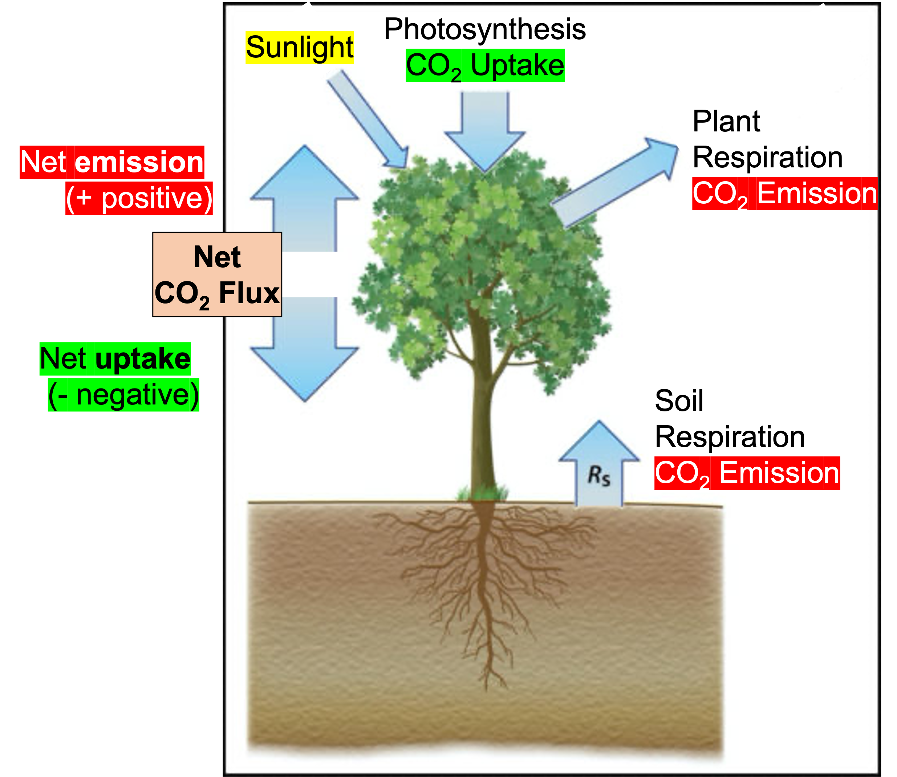

```{r packages, echo = FALSE, message=FALSE, warning=FALSE}
library(tidyverse)
library(tidymodels)
library(patchwork)
library(lubridate)
library(ggtext)
library(knitr)
library(kableExtra)
library(scales)
set.seed(1234)
options(dplyr.print_min = 10, dplyr.print_max = 6)
theme_bw <- theme_bw() + 
  theme(axis.text=element_text(size=20),
        axis.title = element_text(size = 20),
        legend.text = element_text(size = 15), 
        legend.title = element_text(size = 20),
        title = element_text(size = 15))
```

class: middle

# Recap and motivation

---

## Data: Morgan-Monroe State Forest Tower Ecosystem Exchange

```{r out.width="65%", echo=FALSE}

```

---

## Process we're interested in:
### Ecosystem CO2 flux (fco2) (exchange rate of CO2 between ecosystem and atmosphere)

```{r out.width="40%", echo=FALSE}

```

---

## Data

### What do the data look like?

```{r message=FALSE}
monroe_fluxes <- read_csv("data/us-mms-simple.csv") 
```

```{r fix-dates, echo = F}
monroe_fluxes <- monroe_fluxes %>% 
  mutate(date = mdy_hm(date))
head(monroe_fluxes)
```

---

## Data Wrangling

```{r echo = F, message = F}
monroe_fluxes <- monroe_fluxes %>% 
  filter(date >= "2020-01-01" & date <= "2021-01-01") %>% 
      mutate(season = ifelse(date < "2020-04-01", "winter", NA),
         season = ifelse(date < "2020-07-01" & date > "2020-04-01", "spring", season),
         season = ifelse(date < "2020-10-01" & date > "2020-07-01", "summer", season),
         season = ifelse(date < "2020-12-31" & date > "2020-10-01", "fall", season))
```

### Filter for one week in July 2020

```{r}
monroe_fluxes <- monroe_fluxes %>%
  filter(date >= "2020-07-01" & date < "2020-07-08") 
```

```{r}
monroe_fluxes %>% 
  select(date, fco2, incoming_radiation, season) %>% 
head(5)
```


.footnote[
.small[
**The data come from the openintro package: [AmeriFlux](http://https://ameriflux.lbl.gov/).**
]
]

---

## Recap: 

### Exploratory visualization of one week in July 2020

```{r plot-gpp-day, echo = F, out.width="40%"}
monroe_fluxes %>% 
  ggplot(aes(date, fco2)) +
  geom_hline(yintercept = 0) +
  geom_point() +
  geom_line(aes(date, fco2)) +
  geom_line(aes(date, incoming_radiation/10, color = "red")) +
  theme_bw +
  labs(y = expression("Net CO"[2]*" Flux (nmol m"^{-2}*" s"^{-1}*")")) +
  scale_color_manual(values = c("red", "dark green"))  + theme_bw
```

---

## Recap: 

### Fitting a linear model

```{r echo=FALSE, out.width="40%"}
ggplot(monroe_fluxes, aes(x = incoming_radiation, y = fco2)) +
  geom_point(color = "#8E2C90", size = 2) +
  geom_smooth(method = "lm", se = FALSE, color = "#8E2C90") +
  labs(
    x = "Incoming Radiation (W m-2)",
    y = "CO2 Flux (nmol m-2 s-1)",
    title = "CO2 Flux vs. Incoming Radiation",
    subtitle = "A week of data in July 2020"
  ) + theme_bw
```


---

## Recap: 

### Interpreting the slope


```{r elmhurst-fit, echo = FALSE}
linear_reg() %>%
  set_engine("lm") %>%
  fit(fco2 ~ incoming_radiation, data = monroe_fluxes) %>%
  tidy()
```

.pull-left[
```{r echo=FALSE, out.width="60%", message = F}
ggplot(monroe_fluxes, aes(x = incoming_radiation, y = fco2)) +
  geom_point(color = "#8E2C90", size = 2) +
  geom_smooth(method = "lm", se = FALSE, color = "#8E2C90") +
  labs(
    x = "Incoming Radiation (W m-2)",
    y = "CO2 Flux (nmol m-2 s-1)",
    title = "CO2 Flux vs. Incoming Radiation",
    subtitle = "A week of data in July 2020"
  ) + theme_bw
```
]

--
.pull-right[
During this week in July 2020, for **each additional unit of incoming energy (W m-2)**, we would expect **ecosystem flux of carbon dioxide** to change by **-0.027** nmol m-2 s-1.
]
---

### But... is this the case for **every hour** of the observed data? 

```{r echo=FALSE, out.width="40%", message = F}
ggplot(monroe_fluxes, aes(x = incoming_radiation, y = fco2)) +
  geom_point(color = "#8E2C90", size = 2) +
  geom_smooth(method = "lm", se = FALSE, color = "#8E2C90") +
  labs(
    x = "Incoming Radiation (W m-2)",
    y = "CO2 Flux (nmol m-2 s-1)",
    title = "CO2 Flux vs. Incoming Radiation",
    subtitle = "A week of data in July 2020"
  ) + theme_bw
```

--

No - it's an estimate of the average change.

---

class: middle

# Inference

---

## Estimation

So far we have done lots of estimation (mean, median, slope, etc.), i.e.

--

```{r}
monroe_fluxes %>% 
  summarize(mean_fco2 = mean(fco2, na.rm = T))
```

--

```{r elmhurst-fit-3}
linear_reg() %>%
  set_engine("lm") %>%
  fit(fco2 ~ incoming_radiation, data = monroe_fluxes) %>%
  tidy()
```

--

This can be used as an estimate of a **population parameter**. 

---

## Statistical inference 

... is the process of using **sample data** to make conclusions about the larger **population** the sample came from.

- What is the population?
- Do I have a good sample of that population?

```{r echo=FALSE, out.width="50%"}
knitr::include_graphics("img/photo-1571942676516-bcab84649e44.png")
```

---

### If you want to catch a fish, do you prefer a spear or a net?

.pull-left[
*Akin to a single point (e.g., one mean estimate)*

```{r echo=FALSE, out.width="80%"}
knitr::include_graphics("img/spear.png")
```
]
.pull-right[
*Akin to a range (e.g., a range of mean estimates)*
```{r echo=FALSE, out.width="80%"}
knitr::include_graphics("img/net.png")
```
]

---

#### If you want to estimate a population parameter, do you prefer to report a range of values the parameter might be in, or a single value?

--

- If we report a point estimate, we probably won’t hit the exact population parameter
- If we report a range of plausible values we have a good shot at capturing the parameter

---

## Applying to the CO2 fluxes

.pull-left[
```{r echo=FALSE, out.width="70%"}
ggplot(monroe_fluxes, aes(x = incoming_radiation, y = fco2)) +
  geom_point(color = "#8E2C90", size = 2) +
  geom_smooth(method = "lm", se = TRUE, color = "#8E2C90") +
  labs(
    x = "Incoming Radiation (W m-2)",
    y = "CO2 Flux (nmol m-2 s-1)",
    title = "CO2 Flux vs. Incoming Radiation",
    subtitle = "A week of data in July 2020"
  ) + theme_bw
```
]

--
.pull.right[
We define this range using **confidence intervals.**
]

---

class: middle

# Confidence intervals

---

## Confidence intervals

A plausible range of values for the population parameter is a **confidence interval**.

--
- In order to construct a confidence interval we need to quantify the **variability of our sample statistic**

--
- For example, if we want to construct a confidence interval for a population slope, we need to come up with a **plausible range of values** around our observed sample slope

--
- This range will depend on how **precise and how accurate our sample mean is** as an estimate of the population mean

--
- Quantifying this requires a measurement of **how much we would expect the sample to vary between repeated samples**

---

.question[
### Suppose we split the class in half down the middle of the classroom and ask each student their heights. Then, we calculate the mean height of students on each side of the classroom. Would you expect these two means to be exactly equal, close but not equal, or wildly different?
]

--

<br>

.question[
### Suppose you randomly sample 50 students and 5 of them are left handed. If you were to take another random sample of 50 students, how many would you expect to be left handed? Would you be surprised if only 3 of them were left handed? Would you be surprised if 40 of them were left handed?
]

---

## Quantifying the variability of slopes

We can quantify the variability of sample statistics using

- simulation: via bootstrapping (now)

or

- theory: via Central Limit Theorem (other stat courses!)

```{r ref.label="elmhurst-fit", echo=FALSE}
```

---

class: middle

# Bootstrapping

---

## Bootstrapping

.pull-left-wide[
- _"pulling oneself up by one’s bootstraps"_: accomplishing an impossible task without any outside help
- **"Impossible" task:** estimating a population parameter using data from only the given sample
- **Note:** Notion of saying something about a population parameter using only information from an observed sample is the crux of statistical inference
]

class: middle
# 🥾

---

```{r echo=FALSE}
fco2_fit <- linear_reg() %>%
  set_engine("lm") %>%
  fit(fco2 ~ incoming_radiation, data = monroe_fluxes) %>%
  tidy() 

fco2_slope_obs <- fco2_fit %>%
  filter(term == "incoming_radiation") %>%
  pull(estimate) %>%
  round(4)
```

## Observed sample

```{r echo=FALSE, out.width="50%"}
ggplot(monroe_fluxes, aes(x = incoming_radiation, y = fco2)) +
  geom_point(color = "#8E2C90", size = 2) +
  geom_smooth(method = "lm", se = TRUE, color = "#8E2C90") +
  geom_text(aes(x = 600, y = 15), label = paste("slope =", fco2_slope_obs), size = 6, hjust = 0)  +
  labs(
    x = "Incoming Radiation (W m-2)",
    y = "CO2 Flux (nmol m-2 s-1)",
    title = "CO2 Flux vs. Incoming Radiation",
    subtitle = "A week of data in July 2020"
  ) + theme_bw
```

---

## Bootstrap population

What if we only had 30 random hours from this 7 day population of hours (168 total hours)

```{r echo=FALSE, warning=FALSE, out.width="40%"}
monroe_fluxes %>% 
  mutate(row = 1:n(),
         rrow = sample(row, size = n(), replace  = F)) %>% 
  arrange(rrow) %>% 
  mutate(sample = c(rep(1, 30), rep(0, n()-30))) %>% 
  ggplot(aes(x = incoming_radiation, y = fco2, color  = factor(sample), alpha = factor(sample))) +
  geom_point(size = 2) +
  scale_color_manual(values = c("grey", "purple")) +
  scale_alpha_manual(values = c(0.5, 1)) +
  labs( 
    x = "Incoming Radiation (W m-2)",
    y = "CO2 Flux (nmol m-2 s-1)",
    title = "CO2 Flux vs. Incoming Radiation",
    subtitle = "A week of data in July 2020"
  )  + theme_bw
```

---

## Bootstrapping scheme

1. Take a bootstrap sample - a random sample taken **with replacement** from the original sample, of the same size as the original sample

--
2. Calculate the bootstrap statistic - a statistic such as mean, median, proportion, slope, etc. computed on the bootstrap samples

--
3. Repeat steps (1) and (2) many times to create a bootstrap distribution - a distribution of bootstrap statistics

--
4. Calculate the bounds of the XX% confidence interval as the middle XX% of the bootstrap distribution

---

## Bootstrap sample 1

```{r}
monroe_fluxes_boot_1 <- monroe_fluxes %>%
  slice_sample(n = 30, replace = TRUE)
```


```{r echo=FALSE, out.width="40%", message = F}
monroe_fluxes_boot_1_slope <- linear_reg() %>%
  set_engine("lm") %>%
  fit(fco2 ~ incoming_radiation, data = monroe_fluxes_boot_1) %>%
  tidy() %>%
  filter(term == "incoming_radiation") %>%
  pull(estimate) %>%
  round(4)

ggplot(monroe_fluxes_boot_1, aes(x = incoming_radiation, y = fco2)) +
  geom_point(color = "#E48957", size = 2, alpha = 0.8) +
  geom_smooth(method = "lm", se = FALSE, color = "#E48957") +
  geom_text(aes(x = 500, y = 15), label = paste("slope =", monroe_fluxes_boot_1_slope), size = 9, hjust = 0)  +
  labs(
    x = "Incoming radiation (W m-2)",
    y = "CO2 Flux (nmol m-2 s-1)",
    title = "Bootstrap sample 1"
  ) + theme_bw
```

---

## Bootstrap sample 2

```{r}
monroe_fluxes_boot_2 <- monroe_fluxes %>%
  slice_sample(n = 30, replace = TRUE)
```


```{r echo=FALSE, out.width="40%"}
monroe_fluxes_boot_2_slope <- linear_reg() %>%
  set_engine("lm") %>%
  fit(fco2 ~ incoming_radiation, data = monroe_fluxes_boot_2) %>%
  tidy() %>%
  filter(term == "incoming_radiation") %>%
  pull(estimate) %>%
  round(4)

ggplot(monroe_fluxes_boot_2, aes(x = incoming_radiation, y = fco2)) +
  geom_point(color = "#E48957", size = 2, alpha = 0.8) +
  geom_smooth(method = "lm", se = FALSE, color = "#E48957") +
  geom_text(aes(x = 500, y = 15), label = paste("slope =", monroe_fluxes_boot_2_slope), size = 9, hjust = 0)  +
  labs(
    x = "Incoming radiation (W m-2)",
    y = "CO2 Flux (nmol m-2 s-1)",
    title = "Bootstrap sample 2"
  ) + theme_bw
```

---

## Bootstrap sample 3

```{r}
monroe_fluxes_boot_3 <- monroe_fluxes %>%
  slice_sample(n = 30, replace = TRUE)
```


```{r echo=FALSE, out.width="40%"}
monroe_fluxes_boot_3_slope <- linear_reg() %>%
  set_engine("lm") %>%
  fit(fco2 ~ incoming_radiation, data = monroe_fluxes_boot_3) %>%
  tidy() %>%
  filter(term == "incoming_radiation") %>%
  pull(estimate) %>%
  round(4)

ggplot(monroe_fluxes_boot_3, aes(x = incoming_radiation, y = fco2)) +
  geom_point(color = "#E48957", size = 2, alpha = 0.8) +
  geom_smooth(method = "lm", se = FALSE, color = "#E48957") +
  geom_text(aes(x = 500, y = 15), label = paste("slope =", monroe_fluxes_boot_3_slope), size = 9, hjust = 0)  +
  labs(
    x = "Incoming radiation (W m-2)",
    y = "CO2 Flux (nmol m-2 s-1)",
    title = "Bootstrap sample 2"
  ) + theme_bw
```

---

## Bootstrap sample 4

```{r}
monroe_fluxes_boot_4 <- monroe_fluxes %>%
  slice_sample(n = 50, replace = TRUE)
```


```{r echo=FALSE, out.width="40%"}
monroe_fluxes_boot_4_slope <- linear_reg() %>%
  set_engine("lm") %>%
  fit(fco2 ~ incoming_radiation, data = monroe_fluxes_boot_4) %>%
  tidy() %>%
  filter(term == "incoming_radiation") %>%
  pull(estimate) %>%
  round(4)

ggplot(monroe_fluxes_boot_4, aes(x = incoming_radiation, y = fco2)) +
  geom_point(color = "#E48957", size = 2, alpha = 0.8) +
  geom_smooth(method = "lm", se = FALSE, color = "#E48957") +
  geom_text(aes(x = 500, y = 15), label = paste("slope =", monroe_fluxes_boot_4_slope), size = 9, hjust = 0)  +
  labs(
    x = "Incoming radiation (W m-2)",
    y = "CO2 Flux (nmol m-2 s-1)",
    title = "Bootstrap sample 2"
  ) + theme_bw
```

---

## Bootstrap samples 1 - 4

```{r echo=FALSE, out.width="40%"}
ggplot() +
  geom_point(data = monroe_fluxes_boot_1, aes(x = incoming_radiation, y = fco2), color = "#E48957") +
  geom_smooth(data = monroe_fluxes_boot_1, aes(x = incoming_radiation, y = fco2), method = "lm", se = FALSE, color = "#E48957") +
  geom_point(data = monroe_fluxes_boot_2, aes(x = incoming_radiation, y = fco2), color = "#260b27") +
  geom_smooth(data = monroe_fluxes_boot_2, aes(x = incoming_radiation, y = fco2), method = "lm", se = FALSE, color = "#260b27") +
  geom_point(data = monroe_fluxes_boot_3, aes(x = incoming_radiation, y = fco2), color = "#e6b0e7") +
  geom_smooth(data = monroe_fluxes_boot_3, aes(x = incoming_radiation, y = fco2), method = "lm", se = FALSE, color = "#e6b0e7") +
  geom_point(data = monroe_fluxes_boot_4, aes(x = incoming_radiation, y = fco2), color = "orange") +
  geom_smooth(data = monroe_fluxes_boot_4, aes(x = incoming_radiation, y = fco2), method = "lm", se = FALSE, color = "orange") +
  labs(
    x = "Incoming radiation (W m-2)",
    y = "CO2 Flux (nmol m-2 s-1)",
    title = "Bootstrap sample 2"
  ) + theme_bw
```

---

class: middle

we could keep going... but let's make R do things for us!


---


```{r out.width="65%", echo=FALSE}

```

---


## Many many samples...

```{r echo = F}
monroe_fluxes_sample1 <- monroe_fluxes %>% 
  mutate(row = 1:n(),
         rrow = sample(row, size = n(), replace  = F)) %>% 
  arrange(rrow) %>% 
  mutate(splits = c(rep(1:5, 30), rep(6, 18))) %>% 
  filter(splits == 1)
```

```{r}
monroe_fluxes_boot <- bootstraps(monroe_fluxes_sample1, times = 1000)
```


```{r echo=FALSE, out.width="40%"}
monroe_fluxes_models <- monroe_fluxes_boot %>%
  mutate(
    model = map(splits, ~ lm(fco2 ~ incoming_radiation, data = .)),
    coef_info = map(model, tidy)
  )

monroe_fluxes_coefs <- monroe_fluxes_models %>%
  unnest(coef_info)

monroe_fluxes_aug <- monroe_fluxes_models %>%
  mutate(augmented = map(model, augment)) %>%
  unnest(augmented)

ggplot(monroe_fluxes_aug, aes(x = incoming_radiation, y = fco2)) +
  geom_line(aes(y = .fitted, group = id), alpha = 0.2, col = "grey", size = 0.5) +
  geom_point(color = "#8E2C90") +
  labs(
    x = "Incoming radiation (W m-2)",
    y = "CO2 Flux (nmol m-2 s-1)",
    title = "Bootstrap sample 2"
  ) + theme_bw
```

---

## Slopes of bootstrap samples

```{r echo=FALSE}
monroe_fluxes_coefs %>%
  filter(term == "incoming_radiation") %>%
  ggplot(aes(estimate)) +
  geom_histogram(binwidth = 0.0005, alpha = 0.9, fill = "black") +
  labs(title = "Slopes of bootstrap samples") + theme_bw
``` 

---

## 95% confidence interval

```{r echo=FALSE, out.width="40%"}
intervals <- int_pctl(monroe_fluxes_models, coef_info) %>%
  filter(term == "incoming_radiation")

monroe_fluxes_coefs %>%
  filter(term == "incoming_radiation") %>%
  ggplot(aes(estimate)) +
  geom_histogram(binwidth = 0.0005, alpha = 0.7, fill = "gray") +
  labs(title = "Distribution of slopes of bootstrap samples") +
  geom_segment(
    aes(
      x = intervals %>% pull(.lower),
      xend = intervals %>% pull(.lower),
      y = 0,
      yend = 50
    ),
    linetype = "dashed"
  ) +
  geom_text(
    aes(x = intervals %>% pull(.lower), y = 60),
    label = as.character(intervals %>% pull(.lower) %>% round(4)), size = 6
  ) +
  geom_segment(
    aes(
      x = intervals %>% pull(.upper),
      xend = intervals %>% pull(.upper),
      y = 0,
      yend = 50
    ),
    linetype = "dashed"
  ) +
  geom_text(
    aes(x = intervals %>% pull(.upper), y = 60),
    label = as.character(intervals %>% pull(.upper) %>% round(4)), size = 6
  ) +
  geom_segment(
    aes(
      x = intervals %>% pull(.estimate),
      xend = intervals %>% pull(.estimate),
      y = 0,
      yend = 50
    ),
    linetype = "dashed"
  ) +
  geom_text(
    aes(x = intervals %>% pull(.estimate), y = 60),
    label = as.character(intervals %>% pull(.estimate) %>% round(4)), size = 6
  ) + theme_bw
```

---

## Interpreting the slope, take two

```{r echo=FALSE}
int_pctl(monroe_fluxes_models, coef_info)
```

**We are 95% confident that** for each additional unit of incoming radiation, we would expect co2 flux to decrease between `-0.0262` and `-0.0157` nmol m-2 s-1.

---

## Code

```{r eval=FALSE}
# set a seed
set.seed(1234)

# take 1000 bootstrap samples
monroe_fluxes_boot <- bootstraps(monroe_fluxes_sample1, times = 1000) # sample of 30

# for each sample
# fit a model and save output in model column
# tidy model output and save in coef_info column 
monroe_fluxes_models <- monroe_fluxes_boot %>%
  mutate(
    model = map(splits, ~ lm(fco2 ~ incoming_radiation, data = .)),
    coef_info = map(model, tidy)
  )

# unnest coef_info (for intercept and slope)
monroe_fluxes_coefs <- monroe_fluxes_models %>%
  unnest(coef_info)

# calculate 95% (default) percentile interval
int_pctl(monroe_fluxes_models, coef_info)
```
