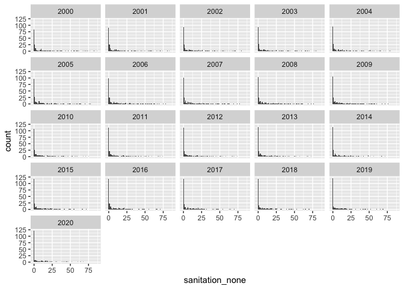
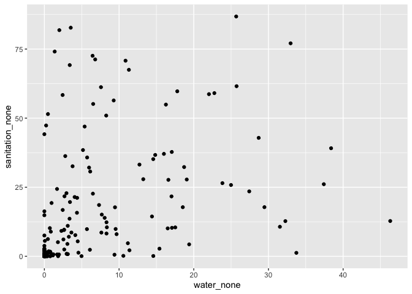
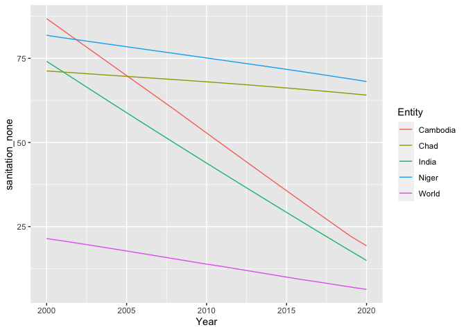

HW 02 - Water and Sanitation - Answer Key
================
Gavin McNicol
2021-09-11

## Load packages and data

``` r
library(tidyverse)
wat_san <- read_csv("data/water-and-sanitation.csv")
```

## Exercises

### Exercise 1

There are 5118 observations in the dataset.

### Exercise 2

Each row in `wat_san` corresponds to a different year of water and
sanitation access observations for each country/entity.

### Exercise 3

Rates of “no sanitation” appear have been reduced. There are fewer
outlier countries with very high rates, and the height of the lowest
possible, 0-1% rate (depends on student choice of bin size for upper
limit here), has increased since 2000.

``` r
ggplot(data = wat_san, mapping = aes(x = sanitation_none)) +
  geom_histogram(binwidth = 1) +
  facet_wrap(~Year)
```

    ## Warning: Removed 140 rows containing non-finite values (stat_bin).

<!-- -->

### Exercise 4

It does not appear that the complete absence of water and sanitation
access are well correlated in the 5 countries with the lowest sanitation
access.

``` r
wat_san %>% 
  filter(Year == 2000) %>% 
  slice_max(sanitation_none, n = 5) %>% 
  arrange(desc(sanitation_none))
```

    ## # A tibble: 5 × 14
    ##   Entity    Year water_improved water_basic water_limited water_unimproved
    ##   <chr>    <dbl>          <dbl>       <dbl>         <dbl>            <dbl>
    ## 1 Cambodia  2000           52.6        52.6          0                21.7
    ## 2 Eritrea   2000           68.7        46.8         21.9              27.8
    ## 3 Niger     2000           41.1        36.8          4.23             56.9
    ## 4 Ethiopia  2000           24.6        18.1          6.50             42.5
    ## 5 India     2000           84.3        80.5          3.86             14.3
    ## # … with 8 more variables: water_none <dbl>, water_safe <dbl>,
    ## #   sanitation_improved <dbl>, sanitation_basic <dbl>,
    ## #   sanitation_limited <dbl>, sanitation_unimproved <dbl>,
    ## #   sanitation_none <dbl>, sanitation_safe <dbl>

### Exercise 5

This does support my previous conclusion that there is no clear
relationship between `water_none` and `sanitation_none` because there is
so much scatter in the data.

``` r
wat_san %>% 
  filter(Year == 2000) %>% 
  ggplot(aes(x = water_none, y = sanitation_none)) + 
  geom_point()
```

    ## Warning: Removed 22 rows containing missing values (geom_point).

<!-- -->

### Exercise 6

The countries with the largest percentage of the population with no
sanitation access have changed between 2000 and 2020. Ethiopia,
Cambodia, Eritrea, and India are no longer in the bottom 5 but Chad,
South Sudan, Benin and Namibia are now present.

``` r
wat_san %>%
  filter(Year == 2020) %>% 
  slice_max(sanitation_none, n = 5) 
```

    ## # A tibble: 5 × 14
    ##   Entity       Year water_improved water_basic water_limited water_unimproved
    ##   <chr>       <dbl>          <dbl>       <dbl>         <dbl>            <dbl>
    ## 1 Niger        2020           68.6        46.9         21.7             27.0 
    ## 2 Chad         2020           60.9        46.2         14.7             31.6 
    ## 3 South Sudan  2020           78.4        41.0         37.4             13.5 
    ## 4 Benin        2020           74.7        65.4          9.32            22.0 
    ## 5 Namibia      2020           91.4        84.3          7.09             3.74
    ## # … with 8 more variables: water_none <dbl>, water_safe <dbl>,
    ## #   sanitation_improved <dbl>, sanitation_basic <dbl>,
    ## #   sanitation_limited <dbl>, sanitation_unimproved <dbl>,
    ## #   sanitation_none <dbl>, sanitation_safe <dbl>

### Exercise 7

Between 2000 and 2020, the summary statistics all decreased in values,
indicating lower amounts of “no sanitation” and lack of access to clean
water.

Overall, values for no sanitation are still higher than values for no
water access.

``` r
wat_san %>% 
  filter(Year == 2000 & Entity != "World" | Year == 2020 & Entity != "World") %>% 
  group_by(Year) %>% 
  summarize(water_none_min = min(water_none, na.rm = T),
            water_none_mean = mean(water_none, na.rm = T),
            water_none_median = median(water_none, na.rm = T),
            water_none_stdev = sd(water_none, na.rm = T),
            water_none_iqr = IQR(water_none, na.rm = T),
            water_none_max = max(water_none, na.rm = T),
            
            sanitation_none_min = min(sanitation_none, na.rm = T),
            sanitation_none_mean = mean(sanitation_none, na.rm = T),
            sanitation_none_median = median(sanitation_none, na.rm = T),
            sanitation_none_stdev = sd(sanitation_none, na.rm = T),
            sanitation_none_iqr = IQR(sanitation_none, na.rm = T),
            sanitation_none_max = max(sanitation_none, na.rm = T)

            )
```

    ## # A tibble: 2 × 13
    ##    Year water_none_min water_none_mean water_none_median water_none_stdev
    ##   <dbl>          <dbl>           <dbl>             <dbl>            <dbl>
    ## 1  2000              0            5.17             0.562             8.67
    ## 2  2020              0            2.06             0                 4.08
    ## # … with 8 more variables: water_none_iqr <dbl>, water_none_max <dbl>,
    ## #   sanitation_none_min <dbl>, sanitation_none_mean <dbl>,
    ## #   sanitation_none_median <dbl>, sanitation_none_stdev <dbl>,
    ## #   sanitation_none_iqr <dbl>, sanitation_none_max <dbl>

### Exercise 8

Cambodia and India both dropped out of the top 5 for “no sanitation”
because rates of open defecation dropped faster there than the world
average, and much faster than in Chad and Niger, where rates stayed
almost constant.

``` r
wat_san %>% 
  filter(Entity == "World" | Entity == "India" | Entity == "Cambodia" | Entity == "Niger" | Entity == "Chad") %>% 
  ggplot(aes(Year, sanitation_none, color = Entity)) +
  geom_line()
```

<!-- -->
